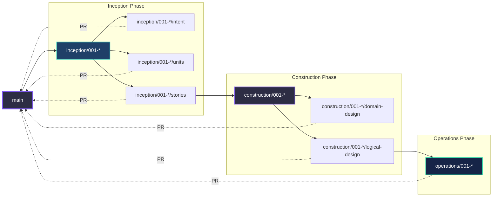
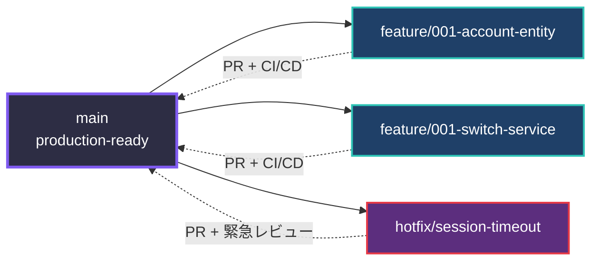

# GitHub Strategy for Context Studio Architecture

**AI-DLC × GitHub最適化戦略**

Context StudioとCode Outputの2リポジトリ体制において、GitHubの機能を最大限活用するための包括的戦略。

---

## 1. Branch Strategy

### 1.1 Context Studio（文脈管理リポジトリ）

**特性**: 低Disposability、戦略的成果物、PO/Architectが主導

#### Branch Model: **Phase-Driven Branching**

```
main
├── inception/001-multi-account          # Inception Phase作業
│   ├── intent                           # Intent明確化
│   ├── units                            # Units分解
│   └── stories                          # User Stories作成
│
├── construction/001-multi-account       # Construction Phase作業
│   ├── domain-design                    # Domain Design作成
│   ├── logical-design                   # ADR作成
│   └── code-mapping                     # Code Outputマッピング
│
└── operations/001-multi-account         # Operations Phase作業
    └── deployment-plan                  # デプロイ計画
```

#### ブランチ命名規則

```
<phase>/<context-id>-<feature-name>[/<artifact-type>]

例:
- inception/001-multi-account
- inception/001-multi-account/intent
- construction/001-multi-account/domain-design
- construction/001-multi-account/logical-design
- operations/001-multi-account
```

#### ワークフロー



#### マージ戦略

| Phase | マージ先 | 承認者 | マージ方法 |
|-------|---------|--------|-----------|
| **Inception** | `main` | Product Owner | Squash Merge（文脈の一貫性） |
| **Construction** | `main` | Architect | Merge Commit（ADR履歴保持） |
| **Operations** | `main` | DevOps Lead | Squash Merge |

**理由**:
- Inception: 試行錯誤の履歴は不要、最終形のみ残す
- Construction: ADRの変更履歴は重要、Merge Commitで保持
- Operations: デプロイ計画の最終版のみ残す

---

### 1.2 Code Output（実装リポジトリ）

**特性**: 高Disposability、実装コード、Developer主導

#### Branch Model: **GitHub Flow + Feature Branching**

```
main (production-ready)
├── feature/001-account-entity           # Context #001対応
├── feature/001-switch-service           # Context #001対応
├── feature/002-payment-gateway          # Context #002対応
├── hotfix/session-timeout               # 緊急修正
└── refactor/auth-service                # リファクタリング
```

#### ブランチ命名規則

```
<type>/<context-id>-<component-name>
<type>/<description>

type:
- feature: 新機能（Context Studio対応）
- hotfix: 緊急修正
- refactor: リファクタリング
- chore: 雑務（依存更新等）

例:
- feature/001-account-entity
- feature/001-switch-service
- hotfix/session-timeout
- refactor/auth-service
```

#### ワークフロー



#### マージ戦略

| Type | マージ先 | 承認者 | マージ方法 | CI/CD |
|------|---------|--------|-----------|-------|
| **feature** | `main` | 2+ Developers | Squash Merge | 必須 |
| **hotfix** | `main` | 1+ Developer | Merge Commit（履歴追跡） | 必須 |
| **refactor** | `main` | 2+ Developers | Squash Merge | 必須 |

**保護ルール（Branch Protection）**:
```yaml
main:
  required_pull_request_reviews: 2
  require_code_owner_reviews: true
  required_status_checks:
    - ci/tests
    - ci/lint
    - ci/security-scan
  enforce_admins: true
  allow_force_pushes: false
```

---

## 2. Issue Strategy

### 2.1 Issue Types（両リポジトリ共通）

#### Context Studio Issues

| Type | Template | Labels | 説明 |
|------|----------|--------|------|
| **Intent** | `intent.md` | `artifact::intent`, `phase::inception` | 新機能・ビジネス意図 |
| **Units Decomposition** | `units.md` | `artifact::units`, `phase::inception` | Units分解タスク |
| **Domain Design** | `domain-design.md` | `artifact::domain-design`, `phase::construction` | ドメインモデル作成 |
| **ADR** | `adr.md` | `artifact::logical-design`, `phase::construction` | 技術判断記録 |
| **Deployment Plan** | `deployment.md` | `artifact::deployment`, `phase::operations` | デプロイ計画 |

#### Code Output Issues

| Type | Template | Labels | 説明 |
|------|----------|--------|------|
| **Feature** | `feature.md` | `type::feature`, `context::###` | Context Studio対応実装 |
| **Bug** | `bug.md` | `type::bug`, `priority::high/medium/low` | 不具合報告 |
| **Refactoring** | `refactor.md` | `type::refactor`, `context::###` | リファクタリング |
| **Technical Debt** | `tech-debt.md` | `type::tech-debt` | 技術的負債 |

---

### 2.2 Issue連携パターン

#### Pattern 1: Context-First Flow（新規開発）

```
Context Studio
├─ Issue #1: Intent "マルチアカウント機能"
│  ├─ Labels: artifact::intent, phase::inception
│  └─ Milestone: Bolt-2024-W42
│
├─ Issue #5: Domain Design "Account Entity"
│  ├─ Labels: artifact::domain-design, phase::construction
│  ├─ Body: "Part of #1"
│  └─ Linked: Code Output yokakit#10
│
└─ Issue #8: ADR-001 "Redis採用決定"
   ├─ Labels: artifact::logical-design, phase::construction
   └─ Body: "Part of #1"

Code Output (yokakit)
└─ Issue #10: Implement Account Entity
   ├─ Labels: type::feature, context::001
   ├─ Body: "Based on Context Studio #5, ADR-001"
   └─ Linked: Context Studio #5
```

**Issue Body Template（Code Output）**:
```markdown
## Context Studio Reference

- **Context ID**: 001-multi-account
- **Domain Design**: [Context Studio #5](https://github.com/org/context-studio/issues/5)
- **ADR**: [ADR-001](https://github.com/org/context-studio/blob/main/.aidlc/contexts/001-multi-account/construction/logical-design/adr/001-redis-session.md)

## Implementation Details

- [ ] Create `Account` model
- [ ] Implement `SwitchAccountService`
- [ ] Add unit tests

## Definition of Done

- [ ] All tests pass
- [ ] Code review approved (2+)
- [ ] ADR-001 compliance verified
```

#### Pattern 2: Code-First Flow（技術的負債・リファクタリング）

```
Code Output (yokakit)
└─ Issue #25: Refactor AuthService for testability
   ├─ Labels: type::refactor, needs-context
   └─ Body: "現状のAuthServiceがテスト困難"

Context Studio
├─ Issue #15: Elevate AuthService to Domain Model
│  ├─ Labels: artifact::domain-design, work::brown-field
│  ├─ Body: "Related to yokakit#25"
│  └─ Milestone: Bolt-2024-W43
│
└─ Issue #16: ADR-002 "AuthService分離戦略"
   ├─ Labels: artifact::logical-design
   └─ Body: "Part of #15"

Code Output (yokakit)
└─ Issue #28: Refactor AuthService (based on Domain Design)
   ├─ Labels: type::refactor, context::002
   └─ Body: "Based on Context Studio #15, ADR-002"
```

---

### 2.3 Cross-Repository Issue Linking

**GitHub CLI活用**:
```bash
# Context Studio IssueからCode Output Issueへ
gh issue create \
  --repo org/yokakit \
  --title "Implement Account Entity" \
  --label "type::feature,context::001" \
  --body "Based on Context Studio org/context-studio#5"

# Code Output PRにContext Studio参照を自動追加
gh pr create \
  --title "feat: Implement Account Entity" \
  --body "$(cat <<EOF
## Context Studio Reference
- Context: 001-multi-account
- Domain Design: org/context-studio#5
- ADR: [ADR-001](link)

## Changes
- Created Account model
- Implemented SwitchAccountService
EOF
)"
```

---

## 3. Label Strategy

### 3.1 Context Studio Labels

#### Artifact Labels（既存）
```yaml
artifact::constitution:
  color: "0e8a16"
  description: "Constitution (0% Disposability)"

artifact::intent:
  color: "fbca04"
  description: "Intent (30% Disposability)"

artifact::units:
  color: "fbca04"
  description: "Units (40% Disposability)"

artifact::stories:
  color: "d93f0b"
  description: "User Stories (50% Disposability)"

artifact::domain-design:
  color: "0e8a16"
  description: "Domain Design (20% Disposability) ⭐重要"

artifact::logical-design:
  color: "0e8a16"
  description: "ADR (20% Disposability) ⭐重要"

artifact::code:
  color: "d93f0b"
  description: "Code (80% Disposability)"

artifact::deployment:
  color: "d93f0b"
  description: "Deployment (70% Disposability)"
```

#### Phase Labels
```yaml
phase::inception:
  color: "1f4068"
  description: "Inception Phase (要件明確化)"

phase::construction:
  color: "533483"
  description: "Construction Phase (設計・実装)"

phase::operations:
  color: "0f3460"
  description: "Operations Phase (デプロイ・運用)"
```

#### Work Type Labels
```yaml
work::green-field:
  color: "5ebeff"
  description: "新規開発"

work::brown-field:
  color: "f9d71c"
  description: "既存システム変更"

work::refactoring:
  color: "ff6b6b"
  description: "リファクタリング"

work::defect:
  color: "d73a49"
  description: "不具合修正"
```

#### Priority Labels（新規）
```yaml
priority::critical:
  color: "d73a49"
  description: "最優先（ブロッカー）"

priority::high:
  color: "d93f0b"
  description: "高優先"

priority::medium:
  color: "fbca04"
  description: "中優先"

priority::low:
  color: "0e8a16"
  description: "低優先"
```

#### Status Labels（新規）
```yaml
status::draft:
  color: "ffffff"
  description: "ドラフト（AI生成中）"

status::review:
  color: "fbca04"
  description: "レビュー待ち"

status::approved:
  color: "0e8a16"
  description: "承認済み"

status::blocked:
  color: "d73a49"
  description: "ブロック中"
```

---

### 3.2 Code Output Labels

#### Type Labels
```yaml
type::feature:
  color: "5ebeff"
  description: "新機能"

type::bug:
  color: "d73a49"
  description: "不具合"

type::refactor:
  color: "ff6b6b"
  description: "リファクタリング"

type::chore:
  color: "fef2c0"
  description: "雑務（依存更新等）"

type::tech-debt:
  color: "f9d71c"
  description: "技術的負債"
```

#### Context Reference Labels
```yaml
context::001:
  color: "1f4068"
  description: "Context Studio: 001-multi-account"

context::002:
  color: "1f4068"
  description: "Context Studio: 002-payment-integration"

needs-context:
  color: "d73a49"
  description: "Context Studio対応が必要"
```

#### Priority/Status Labels（Context Studioと同様）

---

## 4. Pull Request Strategy

### 4.1 Context Studio PR

#### PR Template
```markdown
## Phase
<!-- Inception / Construction / Operations -->
- [ ] Inception
- [ ] Construction
- [ ] Operations

## Artifact Type
<!-- Intent / Units / Stories / Domain Design / ADR / Deployment -->
- Artifact: 

## Context ID
- Context: 001-multi-account

## Changes
<!-- AIによる生成内容、人間による修正内容 -->

## AI Interaction Summary
<!-- AIとの対話サマリー -->
- AI提案: ...
- 人間修正: ...

## Approval Checklist
- [ ] Product Owner reviewed (Inception)
- [ ] Architect reviewed (Construction: Domain/Logical Design)
- [ ] DevOps Lead reviewed (Operations)

## Related Issues
Closes #XX
Part of #YY

## Code Output Impact
<!-- このPRがCode Outputに与える影響 -->
- Impacts: yokakit (submodule)
- Expected Code Output PR: yokakit#ZZ
```

#### PR Review Rules

| Phase | Reviewer | 承認数 | 自動チェック |
|-------|----------|--------|-------------|
| Inception | Product Owner | 1 | Markdown lint, リンク検証 |
| Construction (Domain) | Architect | 1 | Markdown lint, Mermaid検証 |
| Construction (ADR) | Architect + Tech Lead | 2 | ADRフォーマット検証 |
| Operations | DevOps Lead | 1 | YAML/Terraform lint |

---

### 4.2 Code Output PR

#### PR Template
```markdown
## Context Studio Reference
- **Context ID**: 001-multi-account
- **Domain Design**: [#5](context-studio-link)
- **ADR**: [ADR-001](adr-link)
- **Status**: 🟢 Approved

## Type
<!-- Feature / Bug Fix / Refactor / Chore -->
- [ ] Feature
- [ ] Bug Fix
- [ ] Refactor
- [ ] Chore

## Changes
<!-- 変更内容 -->

## ADR Compliance
<!-- ADR-001の遵守状況 -->
- [ ] Redis session management implemented
- [ ] Error handling as per ADR-001
- [ ] Monitoring hooks added

## Testing
- [ ] Unit tests added/updated
- [ ] Integration tests added/updated
- [ ] Manual testing completed

## Definition of Done
- [ ] All tests pass (CI)
- [ ] Code review approved (2+)
- [ ] ADR compliance verified
- [ ] Documentation updated

## Related Issues
Closes #XX
Related to context-studio#YY
```

#### CI/CD Checks（必須）

```yaml
# .github/workflows/pr-validation.yml
name: PR Validation

on:
  pull_request:
    branches: [main]

jobs:
  context-validation:
    runs-on: ubuntu-latest
    steps:
      - name: Validate Context Reference
        run: |
          # PRボディにContext Studio参照があるか確認
          if ! grep -q "Context Studio Reference" <<< "${{ github.event.pull_request.body }}"; then
            echo "Error: Context Studio Reference required"
            exit 1
          fi
      
      - name: Validate ADR Link
        run: |
          # ADRリンクが有効か確認
          # ...

  tests:
    runs-on: ubuntu-latest
    steps:
      - uses: actions/checkout@v3
      - name: Run Tests
        run: composer test

  lint:
    runs-on: ubuntu-latest
    steps:
      - uses: actions/checkout@v3
      - name: Run Linter
        run: composer lint

  security:
    runs-on: ubuntu-latest
    steps:
      - uses: actions/checkout@v3
      - name: Security Scan
        run: composer security-check
```

---

## 5. Milestone & Project Strategy

### 5.1 Milestone = Bolt（最小イテレーション）

**Context StudioとCode Outputで共有**

```
Milestone: Bolt-2024-W42
├─ Duration: 2024-10-14 ~ 2024-10-18 (5日間)
├─ Context Studio Issues:
│  ├─ #1: Intent "マルチアカウント"
│  ├─ #5: Domain Design "Account Entity"
│  └─ #8: ADR-001 "Redis採用"
│
└─ Code Output (yokakit) Issues:
   ├─ #10: Implement Account Entity
   └─ #12: Implement SwitchAccountService
```

**Milestone命名規則**:
```
Bolt-<YYYY>-W<週番号>
例: Bolt-2024-W42
```

**Milestone Description Template**:
```markdown
## Bolt Overview
- **Duration**: 2024-10-14 ~ 2024-10-18
- **Context**: 001-multi-account
- **Goal**: マルチアカウント切り替え機能の実装

## Units in Scope
- Unit 1: アカウント管理（CRUD）
- Unit 2: 認証状態管理

## Expected Deliverables
- [ ] Domain Design: Account Entity
- [ ] ADR-001: Redis session management
- [ ] Code: Account model, SwitchAccountService
- [ ] Tests: 100% coverage

## Dependencies
- Redis Cluster setup (DevOps)
- Authentication service integration

## Risks
- Redis performance under load (mitigation: load testing in staging)
```

---

### 5.2 GitHub Projects（複数Boltの統合管理）

**Project Board: "YokaKit - 2024 Q4"**

```
Columns:
├─ 📋 Backlog (Intent未着手)
├─ 🔵 Inception (要件明確化中)
├─ 🟣 Construction (設計・実装中)
│  ├─ Domain Design
│  ├─ Logical Design
│  └─ Code Implementation
├─ 🟢 Operations (デプロイ準備)
└─ ✅ Done

Automation:
- Issue作成 → Backlog自動追加
- Phase label変更 → Column自動移動
- PR merge → Done自動移動
```

**Project Views**:
1. **Board View**: 上記Column構成
2. **Table View**: Context ID, Phase, Priority, Assigneeでフィルタ
3. **Roadmap View**: Milestone（Bolt）のタイムライン表示

---

## 6. Automation & Integration

### 6.1 GitHub Actions Workflows

#### Context Studio: Auto-Labeling
```yaml
# .github/workflows/auto-label.yml
name: Auto Label

on:
  issues:
    types: [opened]
  pull_request:
    types: [opened]

jobs:
  label:
    runs-on: ubuntu-latest
    steps:
      - name: Label by Path
        uses: actions/labeler@v4
        with:
          configuration-path: .github/labeler.yml

      - name: Label by Phase (branch name)
        run: |
          BRANCH="${{ github.head_ref }}"
          if [[ $BRANCH == inception/* ]]; then
            gh issue edit ${{ github.event.number }} --add-label "phase::inception"
          elif [[ $BRANCH == construction/* ]]; then
            gh issue edit ${{ github.event.number }} --add-label "phase::construction"
          elif [[ $BRANCH == operations/* ]]; then
            gh issue edit ${{ github.event.number }} --add-label "phase::operations"
          fi
```

#### Code Output: Context Validation
```yaml
# .github/workflows/context-validation.yml
name: Context Validation

on:
  pull_request:
    branches: [main]

jobs:
  validate-context:
    runs-on: ubuntu-latest
    steps:
      - name: Check Context Reference
        run: |
          BODY="${{ github.event.pull_request.body }}"
          
          # Context ID存在確認
          if ! grep -qE "Context ID.*:\s*[0-9]{3}-" <<< "$BODY"; then
            echo "❌ Context ID missing"
            exit 1
          fi
          
          # ADRリンク存在確認
          if ! grep -q "ADR:" <<< "$BODY"; then
            echo "❌ ADR reference missing"
            exit 1
          fi
          
          echo "✅ Context reference valid"
```

---

### 6.2 Submodule Auto-Update

```yaml
# Context Studio: .github/workflows/submodule-sync.yml
name: Submodule Sync

on:
  schedule:
    - cron: '0 0 * * *'  # 毎日0時
  workflow_dispatch:

jobs:
  sync:
    runs-on: ubuntu-latest
    steps:
      - uses: actions/checkout@v3
        with:
          submodules: recursive
          token: ${{ secrets.PAT }}
      
      - name: Update Submodules
        run: |
          git submodule update --remote --merge
      
      - name: Create PR if changed
        uses: peter-evans/create-pull-request@v5
        with:
          commit-message: "chore: Update submodules (daily sync)"
          title: "Daily Submodule Sync"
          body: |
            ## Updated Submodules
            
            - yokakit: $(git -C submodules/code-output/yokakit log -1 --oneline)
            
            ## Action Required
            - [ ] Review changes
            - [ ] Verify no breaking changes
          branch: chore/submodule-sync
          labels: type::chore
```

---

## 7. Best Practices Summary

### 7.1 Context Studio

✅ **DO**:
- Phase別ブランチで作業（`inception/001-*`, `construction/001-*`）
- ADRはMerge Commitで履歴保持
- PR DescriptionにAIとの対話サマリーを記載
- Code Output Impactを明記

❌ **DON'T**:
- `main`に直接コミット
- Phase混在ブランチ（Inception + Constructionを同時）
- ADRなしでCode生成指示

---

### 7.2 Code Output

✅ **DO**:
- 必ずContext Studio参照を記載（Context ID, ADR）
- feature/###-* で Context IDを明示
- CI/CD全パス後にマージ
- Squash Mergeで履歴をクリーンに

❌ **DON'T**:
- Context参照なしでfeature作成
- CI/CD失敗状態でマージ
- ADR違反のコード

---

### 7.3 Cross-Repository

✅ **DO**:
- Issue/PRで相互リンク（`org/repo#123`）
- MilestoneをBolt単位で共有
- Submodule更新時は明示的コミット

❌ **DON'T**:
- Context Studio未着手でCode実装開始
- Submodule更新を忘れてContext Studioにコミット

---

## 8. Quick Reference

### Branch Cheat Sheet

```bash
# Context Studio
git checkout -b inception/001-multi-account
git checkout -b construction/001-multi-account/domain-design
git checkout -b operations/001-multi-account

# Code Output
git checkout -b feature/001-account-entity
git checkout -b hotfix/session-timeout
git checkout -b refactor/auth-service
```

### Issue Creation

```bash
# Context Studio: Intent作成
gh issue create \
  --title "[Intent] マルチアカウント切り替え機能" \
  --label "artifact::intent,phase::inception,priority::high" \
  --milestone "Bolt-2024-W42"

# Code Output: Feature作成（Context参照）
gh issue create \
  --title "Implement Account Entity" \
  --label "type::feature,context::001" \
  --body "Based on Context Studio #5 (Domain Design)"
```

### PR Creation

```bash
# Context Studio
gh pr create \
  --title "Add Domain Design for Account Entity" \
  --label "artifact::domain-design,phase::construction" \
  --body-file .github/PULL_REQUEST_TEMPLATE/context-studio.md

# Code Output
gh pr create \
  --title "feat: Implement Account Entity" \
  --label "type::feature,context::001" \
  --body-file .github/PULL_REQUEST_TEMPLATE/code-output.md
```

---

## Appendix: Template Files

### A1. Context Studio Issue Templates

#### `.github/ISSUE_TEMPLATE/intent.md`
```markdown
---
name: Intent（意図）
about: 新機能・ビジネス意図の定義
labels: artifact::intent, phase::inception
---

## Business Intent
<!-- ビジネス上の目的・問題意識 -->

## Key Stakeholders
<!-- 主要なステークホルダー -->
- Product Owner: @username
- Business: @username

## Success Criteria
<!-- 成功基準 -->
- [ ] ...

## Related Context
<!-- 関連する既存Context -->

## AI Elaboration Questions
<!-- AIに明確化してほしい質問 -->
```

### A2. Code Output Issue Templates

#### `.github/ISSUE_TEMPLATE/feature.md`
```markdown
---
name: Feature（機能実装）
about: Context Studioに基づく機能実装
labels: type::feature
---

## Context Studio Reference
- **Context ID**: 
- **Domain Design**: [link]
- **ADR**: [link]

## Implementation Tasks
- [ ] ...

## Definition of Done
- [ ] All tests pass
- [ ] Code review approved (2+)
- [ ] ADR compliance verified
- [ ] Documentation updated
```

---
