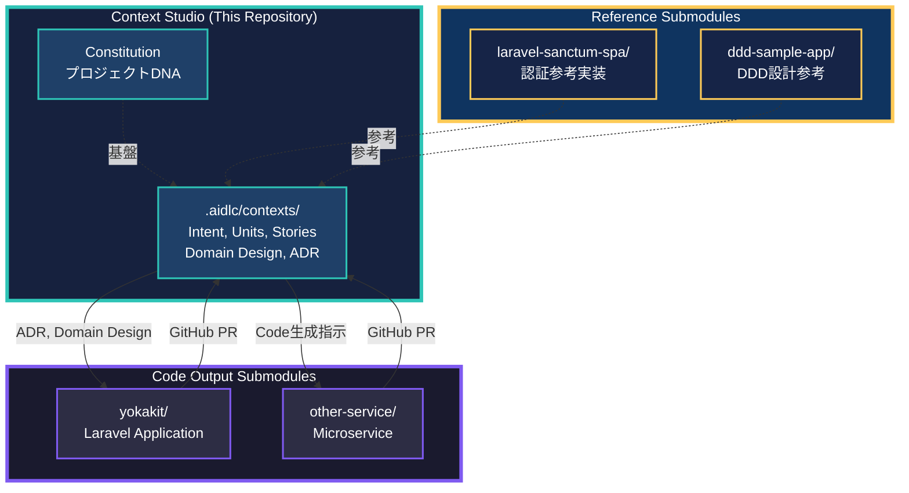
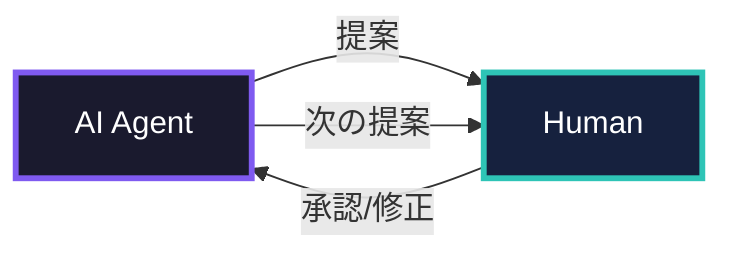
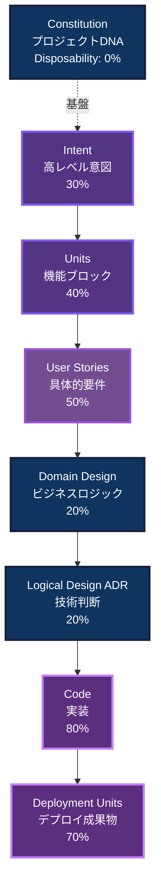
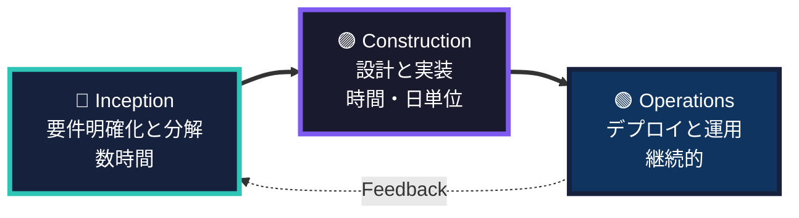
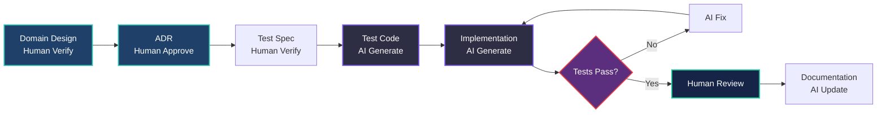
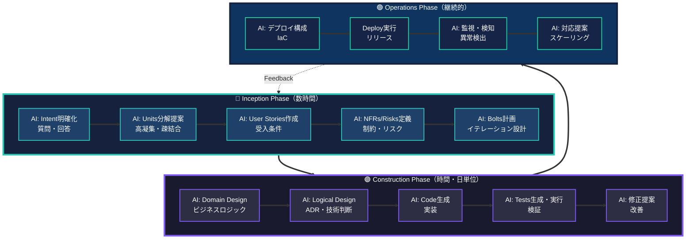

# YokaKit Studio - GitHub-Centric Context Studio for AI-DLC

**AI-Driven Development Lifecycle（AI-DLC）をGitHub中心で実践する文脈統合開発環境**

> 🎯 **解決する問題**: AIとの対話履歴が散逸し、「なぜこの設計にしたのか」が失われる  
> 🚀 **革新的アプローチ**: 文脈（Context）とコードを分離し、GitHub Submoduleで統合管理  
> ✨ **解決策**: すべての成果物を構造化して永続化し、AIが常に正しい文脈を参照できる環境

---

## Revolutionary Approach: Context Studio Architecture

### 従来のAI-DLC実践との違い

**従来**: 単一リポジトリで完結
```
my-project/
├── .aidlc/              # 文脈
├── src/                 # コード
└── tests/               # テスト
```
**問題点**:
- ❌ 文脈（低Disposability）とコード（高Disposability）が混在
- ❌ 複数プロジェクトで文脈を共有できない
- ❌ 参考にした既存コードとの関係が不明確

---

**YokaKit Studio**: GitHub中心のマルチリポジトリ
```
Context-Studio/                    # このリポジトリ（文脈管理）
├── .aidlc/                        # AI-DLC文脈（Constitution, ADR, Domain Design）
├── submodules/
│   ├── code-output/               # ← Submodule: 出力先コードリポジトリ
│   │   └── yokakit/               #    (Laravel application)
│   └── references/                # ← Submodules: 参考リポジトリ群
│       ├── laravel-sanctum-spa/   #    認証参考実装
│       └── ddd-sample-app/        #    DDD設計参考
└── README.md
```

**革新ポイント**:
- ✅ **文脈とコードの分離**: Disposabilityに応じた最適な管理
- ✅ **複数プロジェクト対応**: 1つのContext Studioから複数Output
- ✅ **参照の明示化**: 参考にした既存コードをSubmoduleで追跡
- ✅ **権限分離**: Context（PO/Architect）とCode（Developer）で異なる権限
- ✅ **トレーサビリティ**: GitHub Issues/PRで文脈↔コードを紐付け

---

## What: YokaKit Studio とは

**Context Studio**（文脈統合開発環境）- AIが主導する開発ワークフローで生成されるすべての文脈成果物（Constitution, Intent, Domain Design, ADR）を構造化管理し、コードリポジトリ（Submodule）と連携して高品質なシステムを構築する環境。

### Architecture Diagram



### 従来のAI開発ツールとの違い

| 観点 | 従来のAI開発ツール | YokaKit Studio |
|------|-------------------|----------------|
| **リポジトリ構成** | 単一リポジトリ | **Context + Code分離（Submodule）** |
| **文脈管理** | チャット履歴のみ | **構造化された成果物階層** |
| **トレーサビリティ** | なし | **Intent → Code の双方向追跡（GitHub Issues/PR）** |
| **参照管理** | 不明確 | **参考リポジトリもSubmodule化** |
| **会話の主導権** | 人間が指示 | **AIが提案・人間が検証** |
| **設計の永続化** | コードのみ | **Domain Design + ADR + Code** |
| **イテレーション** | 週・月単位 | **時間・日単位（Bolt）** |

### 核心価値: Context Memory

```
Intent（意図）
  ↓ 検証
Units（機能分割）
  ↓ 検証
User Stories（要件）
  ↓ 検証
Domain Design（ビジネスロジック）
  ↓ 検証
Logical Design（技術判断・ADR）
  ↓ 検証
Code（実装）

各段階で検証 = Loss Function（下流の無駄削減）
すべて永続化 = AIが常に正しい文脈を参照
```

---

## Why: なぜ必要か

### 問題0: 従来のAI-DLC実践は単一リポジトリで完結

**単一リポジトリの限界**:
- ❌ 文脈（低Disposability）とコード（高Disposability）が混在
- ❌ 複数プロジェクト（マイクロサービス等）で文脈を共有できない
- ❌ 参考にした既存コードとの関係が不明確
- ❌ 権限管理が困難（PO/Architectとの分離）

**YokaKit StudioのContext Studio方式**:
- ✅ **物理的分離**: Context StudioとCode Outputを別リポジトリ
- ✅ **Submodule統合**: Git Submoduleで連携（トレーサビリティ維持）
- ✅ **複数Output対応**: 1つのContext Studioから複数サービス管理
- ✅ **参照の明示化**: 参考リポジトリもSubmodule化
- ✅ **権限分離**: Context（戦略）とCode（実装）で異なるアクセス権

### 問題1: 従来のIDEは「コードしか見ない」

**コードから失われる情報**:
- ❌ なぜこの設計を選んだのか（トレードオフ）
- ❌ なぜ他の選択肢を採用しなかったのか
- ❌ どのビジネス意図に対応しているのか

**YokaKit Studioの解決**:
- ✅ Architecture Decision Records（ADR）でトレードオフを記録
- ✅ Domain Designでビジネスロジックを明示
- ✅ Intent → Code の双方向トレーサビリティ（GitHub Issues/PR連携）

### 問題2: Agile/ScrumはAI時代に最適化されていない

**従来のAgile（週・月単位前提）**:
- 日次スタンダップ → AI-DLCでは**リアルタイム検証**
- ストーリーポイント → AIが難易度境界を消す
- ベロシティ測定 → **ビジネス価値**で測定すべき

**YokaKit StudioのAI-DLC**:
- ⚡ 時間・日単位のイテレーション（Bolt）
- 🤖 AI主導の計画・分解・実装
- 👤 人間は検証・承認・戦略決定に集中

### 問題3: AIの能力と限界の不明確さ

**現実**:
- ❌ AIは高レベルIntentから直接コードを生成できない（まだ）
- ❌ AI生成コードは「Quick Cement」（後で変更困難）になりがち
- ✅ AIは段階的計画・分解・実装は得意

**YokaKit Studioのアプローチ**:
- **AI-Driven**: AIが主導（AI-Assistedではない）
- **人間が最終責任**: 各段階で検証・承認
- **段階的検証**: Intent → Units → Stories → Design → Code

---

## How: Quick Start

### Prerequisites

- **Git**: Submodule管理に必要
- **Claude Code CLI**（またはAI-DLC対応AI環境）
- (Optional) Docker for Laravel development

### Step 1: Context Studio初期化

#### 1-1. 既存Context Studioをクローン（チーム参加時）

```bash
# Context Studioをクローン
git clone https://github.com/w-pinkietech/YokaKit_Studio
cd YokaKit_Studio

# すべてのSubmodule（Code Output + References）を初期化
git submodule update --init --recursive

# 構成確認
tree -L 2 submodules/
# submodules/
# ├── code-output/
# │   └── yokakit/                # ← Laravel Application
# └── references/
#     ├── laravel-sanctum-spa/    # ← 認証参考
#     └── ddd-sample-app/         # ← DDD参考
```

#### 1-2. 新規Context Studio作成（新プロジェクト開始時）

```bash
# 空のContext Studioリポジトリ作成
mkdir my-context-studio
cd my-context-studio
git init

# 基本構造作成
mkdir -p .aidlc/contexts
mkdir -p .aidlc-docs/plans
mkdir -p .claude/commands
mkdir -p submodules/code-output
mkdir -p submodules/references

# Code Outputリポジトリを作成してSubmodule追加
# (事前にGitHubでリポジトリ作成しておく)
git submodule add https://github.com/your-org/your-app.git submodules/code-output/your-app

# 参考リポジトリを追加（Read-Only推奨）
git submodule add https://github.com/laravel/sanctum.git submodules/references/laravel-sanctum

# .gitmodulesの確認
cat .gitmodules
# [submodule "submodules/code-output/your-app"]
#     path = submodules/code-output/your-app
#     url = https://github.com/your-org/your-app.git
# [submodule "submodules/references/laravel-sanctum"]
#     path = submodules/references/laravel-sanctum
#     url = https://github.com/laravel/sanctum.git

# コミット
git add .
git commit -m "Initialize Context Studio structure"
git remote add origin https://github.com/your-org/context-studio.git
git push -u origin main
```

### Step 2: Constitution（プロジェクトDNA）の作成

```bash
/constitution
```

AI が質問します：
- プロジェクトの目的は？
- 技術スタック制約は？
- コーディング規約は？
- リスク管理の基準は？

**これがプロジェクト全体の基盤になります（Disposability: 0%）**

### Step 3: Code Outputリポジトリとの連携確認

```bash
# Code Outputリポジトリの状態確認
cd submodules/code-output/yokakit
git status
git log -1

# Context Studioに戻る
cd ../../..

# Submoduleの最新状態を反映
git submodule update --remote
```

### Step 4: 最初のIntentを入力

```bash
/inception "ユーザーが複数アカウントを切り替えられる機能"
```

**AIが会話をリード**します：

```
AI: この機能について質問があります：
    1. 主要なユーザーは誰ですか？
    2. 同時に何個のアカウントを切り替える想定ですか？
    3. 認証状態は共有されますか？

You: 1. エンドユーザー（一般消費者）
     2. 最大5個まで
     3. 共有しない（独立）

AI: Units分解を提案します：
    - Unit 1: アカウント管理（CRUD）
    - Unit 2: 認証状態管理
    - Unit 3: UI/UX（切り替えインターフェース）
    承認しますか？ [y/n]

You: y

AI: User Storiesを作成しました：
    → .aidlc/contexts/001-multi-account/inception/stories/
    レビューしてください。

You: （レビュー後）承認

AI: Bolts計画を提案します：
    - Bolt 1: Unit 1 + Unit 2（2日間）
    - Bolt 2: Unit 3（1日間）
    承認しますか？ [y/n]
```

### Step 5: Construction Phase（TDD & Documentation-Driven）

**完全版**: [.development-process.md](.development-process.md) を参照

YokaKit StudioではAIがほぼすべてのコードを書くため、**Documentation-First × TDD**を徹底します。

```bash
# Context Studioで実行
/construction unit-1-account-management
```

**開発プロセス**:
```
1. Domain Design（ドキュメント）
   → AI: Static/Dynamic Model生成
   → Human: 検証・承認
   → Commit: Domain Design

2. Logical Design（ADR）
   → AI: Architecture提案
   → Human: トレードオフ検証・承認
   → Commit: ADR

3. Test Specification（テスト先行）
   → AI: Test Cases生成
   → Human: Test Cases検証
   → AI: Test Code生成（実装なし）
   → Commit: Tests Only (すべてFAIL)

4. Code Generation（実装）
   → AI: Implementation生成
   → Run Tests → 失敗 → AI修正 → 成功
   → Human: Code Review
   → Commit: Implementation (すべてPASS)

5. Documentation Update
   → AI: Code Mapping更新
   → AI: API Doc生成
   → Commit: Documentation
```

**品質ゲート**:
- ✅ カバレッジ100%必須
- ✅ すべてのテストパス必須
- ✅ ADR準拠チェック必須
- ✅ Context参照必須

**AIが段階的に提案**します：

1. **Domain Design**（ビジネスロジック）
   ```
   AI: 静的モデル:
       - Account Entity (id, name, credentials)
       - AccountRepository Interface
       - SwitchAccountService
       
       動的モデル:
       - アカウント切り替えフロー図
       
       承認しますか？
   ```

2. **Logical Design**（技術判断・ADR）
   ```
   AI: ADR-001: 認証状態の管理方法
       採用: Redis Cluster
       理由: マルチデバイス対応、セッション共有
       不採用: JWT
       理由: デバイス間同期が困難
       
       承認しますか？
   ```

3. **Code生成**（Code Outputリポジトリに出力）
   ```
   AI: Codeを生成しました（Code Output: yokakit）：
       → submodules/code-output/yokakit/app/Models/Account.php
       → submodules/code-output/yokakit/app/Services/SwitchAccountService.php
       → submodules/code-output/yokakit/app/Repositories/AccountRepository.php
       
       code-mapping.mdを更新しました：
       → .aidlc/contexts/001-multi-account/construction/code-mapping.md
       
       レビューしてください。
   ```

4. **Tests生成・実行**
   ```
   AI: Testsを生成・実行しました：
       ✅ AccountTest: 5/5 passed
       ✅ SwitchAccountServiceTest: 8/8 passed
   ```

### Step 6: Code OutputをGitHubにプッシュ

```bash
# Code Outputリポジトリに移動
cd submodules/code-output/yokakit

# 生成されたコードを確認
git status
# Changes not staged for commit:
#   modified:   app/Models/Account.php
#   modified:   app/Services/SwitchAccountService.php
#   (new file)  app/Repositories/AccountRepository.php

# コミット
git add .
git commit -m "Implement multi-account switching

Based on Context Studio:
- ADR-001: Redis-based session management
- Domain Design: Account Entity, SwitchAccountService

Ref: YokaKit_Studio/.aidlc/contexts/001-multi-account/"

# プッシュ
git push origin main

# Context Studioに戻る
cd ../../..

# SubmoduleのコミットハッシュをContext Studioに反映
git add submodules/code-output/yokakit
git commit -m "Update yokakit submodule: Implement multi-account (Context #001)"
git push origin main
```

### Step 7: Operations Phase

```bash
# Context Studioで実行
/operations deploy unit-1-account-management
```

```
AI: デプロイ構成を提案します：
    - Infrastructure: AWS ECS Fargate
    - Cache: Redis Cluster (ElastiCache)
    - Monitoring: CloudWatch + X-Ray
    承認しますか？

You: 承認

AI: デプロイ完了。監視を開始しました。
```

---

## Core Concepts: AI-DLC の基礎

### 1. AI が会話をリード、人間が検証

**Google Maps の比喩**：
- 人間：目的地を設定（Intent）
- AI：ルートを提案、ナビゲーション
- 人間：監督、必要に応じて調整



### 2. Artifacts（成果物）階層構造



#### Disposability（代替可能性）とは

**AIによる再生成の難易度** - 低いほど永続化が重要：

| Artifact | Disposability | 永続化の重要性 | 理由 |
|----------|--------------|---------------|------|
| **Constitution** | 0% | ⭐⭐⭐⭐⭐ | プロジェクトDNA、AIリバース不可 |
| **Domain Design** | 20% | ⭐⭐⭐⭐⭐ | ビジネスロジック、コードから復元困難 |
| **Logical Design (ADR)** | 20% | ⭐⭐⭐⭐⭐ | トレードオフ・不採用理由はコードにない |
| **Intent** | 30% | ⭐⭐⭐⭐ | 問題意識、部分的復元可能 |
| **Units** | 40% | ⭐⭐⭐ | 機能分割、再設計コスト中 |
| **User Stories** | 50% | ⭐⭐⭐ | 要件、比較的復元可能 |
| **Deployment Units** | 70% | ⭐⭐ | IaCから再生成可能 |
| **Code** | 80% | ⭐ | AIが完全再生成可能 |

**重要な洞察**:
> AIのリバースエンジニアリングは「今ある形」の復元のみ。  
> **意図・トレードオフ・不採用理由・ビジネスロジックはコードから出てこない**。  
> だから残すべきは: **Constitution + Domain Design + Logical Design (ADR)**

### 3. Phases（開発フェーズ）



#### Inception Phase - Mob Elaboration（全員協働必須）

**時間**: 数時間（従来の数週間 → 数時間に短縮）  
**場所**: 1つの部屋（または仮想空間）  
**参加者**: Product Owner, Developers, QA, Stakeholders

```
Intent（ビジネス意図）
  → AI: 質問・明確化 → 人間: 回答
  → AI: Units分解提案 → 人間: 検証・修正
  → AI: User Stories作成 → 人間: 検証・修正
  → AI: NFRs/Risks定義 → 人間: 検証・修正
  → AI: Bolts計画提案 → 人間: 承認

成果物: Units, User Stories, NFRs, Risks, PRFAQ
```

#### Construction Phase - Mob Construction（全員協働推奨）

**時間**: 時間・日単位（Bolt）  
**場所**: 1つの部屋（または仮想空間）  
**参加者**: Developers（複数チーム並行可能）

```
User Stories
  → AI: Domain Design提案 → 人間: 検証
  → AI: Logical Design提案 → 人間: 検証（トレードオフ承認）
  → AI: Code生成 → 人間: レビュー
  → AI: Tests生成・実行 → 人間: 結果確認
  → AI: 修正提案 → 人間: 承認

成果物: Domain Design, Logical Design (ADR), Code, Tests
```

#### Operations Phase

```
Deployment Units
  → AI: デプロイ構成提案 → 人間: 承認
  → Deploy実行
  → AI: 監視・異常検知 → 人間: 確認
  → AI: 対応提案（スケーリング等） → 人間: 承認・実行

成果物: Deployed System, Observability Data
```

### 4. Bolt（最小イテレーション）

**Bolt = Sprint の AI-DLC版**

| 項目 | Sprint（Agile） | Bolt（AI-DLC） |
|------|----------------|----------------|
| **期間** | 2-4週間 | 時間・日単位 |
| **スコープ** | Epic/複数Stories | 1 Unit または Unit内複数Stories |
| **計画** | 人間が計画 | AIが提案、人間が承認 |
| **成果物** | 動くソフトウェア | テスト済みDeployment Unit |

### 5. Context Memory（文脈記憶）

**すべての成果物を永続化し、AIが参照**

```
Intent → Units → Stories → Domain → Logical → Code
  ↓       ↓       ↓         ↓         ↓        ↓
  保存    保存    保存      保存      保存     保存
  ↓       ↓       ↓         ↓         ↓        ↓
  ←───── トレーサビリティ（双方向リンク） ──────
```

**利点**:
- 各ステップの成果物が次のステップの文脈になる
- 「なぜこの設計にしたか」を追跡可能
- AI は常に最新・正確な文脈を参照して提案

### 6. 人間の役割 = Loss Function（損失関数）

各ステップでの人間の検証が、下流への無駄な作業を防ぐ：

```
Intent検証 ─ミス発見→ 早期修正（コスト: 小）
  ↓ ✓ OK
Units検証 ─ミス発見→ 修正（コスト: 中）
  ↓ ✓ OK
Stories検証 ─ミス発見→ 修正（コスト: 中）
  ↓ ✓ OK
Design検証 ─ミス発見→ 修正（コスト: 大）
  ↓ ✓ OK
Code検証 ─ミス発見→ 修正（コスト: 特大）
```

**早い段階での検証ほど、修正コストが低い**

### 7. AIの役割と人間の責任

**AI-Drivenだが、完全自動ではない**:
- **AI**: 計画・分解・コード生成・提案
- **人間**: 最終責任・検証・判断・承認

**現実認識**:
- ❌ 現在のAIは高レベルIntentから直接コードを生成できない
- ❌ AI生成コードは「Quick Cement」になりやすい
- ✅ 段階的計画・分解は得意
- ✅ だから**段階的検証が必須**

---

## Project Structure

### Context Studio（このリポジトリ）

AI-DLC文脈を管理し、複数のCode Outputリポジトリを統合：

```
YokaKit_Studio/                        # Context Studio（このリポジトリ）
│
├── .aidlc/                            # 🔵 AI-DLC文脈ストレージ（低Disposability）
│   ├── constitution.md                # Foundation: プロジェクトDNA (0%)
│   │                                  # - 技術スタック、コーディング規約
│   │                                  # - リスク管理基準、組織原則
│   │
│   └── contexts/                      # Feature contexts
│       ├── 001-multi-account/         # Example: マルチアカウント機能
│       │   ├── inception/
│       │   │   ├── intent.md          # Intent (30%)
│       │   │   ├── units.md           # Units breakdown (40%)
│       │   │   ├── stories/           # User Stories (50%)
│       │   │   ├── nfrs.md            # Non-Functional Requirements
│       │   │   ├── risks.md           # Risk descriptions
│       │   │   └── prfaq.md           # PRFAQ (optional)
│       │   │
│       │   ├── construction/
│       │   │   ├── domain-design/     # Domain Design (20%) ⭐重要
│       │   │   │   ├── static-model.md   # Components, relationships
│       │   │   │   └── dynamic-model.md  # Interactions, use cases
│       │   │   │
│       │   │   ├── logical-design/    # Logical Design (20%) ⭐重要
│       │   │   │   ├── adr/           # Architecture Decision Records
│       │   │   │   │   ├── 001-auth-state-management.md
│       │   │   │   │   └── 002-cache-strategy.md
│       │   │   │   └── architecture.md
│       │   │   │
│       │   │   └── code-mapping.md    # Code Outputへのマッピング
│       │   │       # Example:
│       │   │       # - yokakit/app/Models/Account.php → Account Entity
│       │   │       # - yokakit/app/Services/SwitchAccountService.php → SwitchAccountService
│       │   │
│       │   └── operations/
│       │       ├── deployment-plan.md
│       │       └── playbooks/
│       │
│       └── 002-payment-integration/   # 他の機能も同様の構造
│
├── .aidlc-docs/                       # Workflow documentation
│   ├── plans/                         # AI-generated plans
│   └── prompts.md                     # Prompt history
│
├── .claude/                           # Claude Code CLI config
│   └── commands/                      # AI-DLC workflow commands
│       ├── inception.md
│       ├── construction.md
│       └── operations.md
│
├── submodules/                        # 🟣 Git Submodules
│   ├── code-output/                   # 出力先コードリポジトリ
│   │   ├── yokakit/                   # ← Submodule: Laravel Application
│   │   │                              #    Repository: w-pinkietech/YokaKit
│   │   └── payment-service/           # ← Submodule: Payment Microservice
│   │                                  #    Repository: w-pinkietech/YokaKit-Payment
│   │
│   └── references/                    # 参考リポジトリ（Read-Only推奨）
│       ├── laravel-sanctum-spa/       # ← Submodule: 認証参考実装
│       │                              #    Repository: laravel/sanctum (fork)
│       └── ddd-sample-app/            # ← Submodule: DDD設計参考
│                                      #    Repository: dddinphp/sample
│
├── .gitmodules                        # Submodule設定ファイル
├── README.md                          # このファイル
└── LICENSE
```

### Code Output Repository（Submodule）

実装コード（高Disposability）を管理：

```
yokakit/                               # Submodule: Laravel Application
├── app/
│   ├── Models/
│   │   └── Account.php                # ← .aidlc/contexts/001-.../domain-design/に対応
│   ├── Services/
│   │   └── SwitchAccountService.php   # ← 同上
│   └── Http/Controllers/
│
├── tests/
│   └── Feature/
│       └── AccountSwitchTest.php
│
├── .github/
│   └── workflows/
│       └── ci.yml                     # CI/CD（Context StudioのADRに従う）
│
└── README.md                          # Code側のREADME
                                       # → Context Studioへのリンク記載推奨
```

### GitHub Issues/PR連携（トレーサビリティ）

```
Context Studio Issue #15
├─ Title: "認証状態管理のADR作成（ADR-001）"
├─ Labels: artifact::logical-design, phase::construction
├─ Body: Intent #001へのリンク
└─ Linked PR:
    ├─ Context Studio PR #20: "ADR-001: Redis採用決定"
    └─ Code Output (yokakit) PR #5: "Implement Redis-based session"
        └─ Description: "Context Studio ADR-001に基づく実装"
```

---

## Commands Reference

### Foundation

```bash
/constitution                    # プロジェクトDNA作成・更新
```

### Inception Phase

```bash
/inception <intent>              # Inception開始（対話的）
                                 # 1. Intent明確化
                                 # 2. Units分解
                                 # 3. User Stories作成
                                 # 4. NFRs/Risks定義
                                 # 5. Bolts計画
```

### Construction Phase

```bash
/construction <unit-name>        # Construction開始（対話的）
                                 # 1. Domain Design
                                 # 2. Logical Design (ADR)
                                 # 3. Code生成（→ Code Output Submodule）
                                 # 4. Tests生成・実行
                                 # 5. 修正提案

# Brown-Field（既存システム変更）
/elevate-code <path>             # 既存コード → モデル昇格
                                 # path: submodules/code-output/yokakit/app/...
```

### Operations Phase

```bash
/operations deploy <unit>        # デプロイ実行
/operations monitor              # 監視・異常検知
/operations recommend            # 対応提案
```

### Submodule Management

```bash
# Submodule追加
git submodule add <repo-url> submodules/code-output/<name>
git submodule add <repo-url> submodules/references/<name>

# Submodule初期化（クローン後）
git submodule update --init --recursive

# Submodule最新化
git submodule update --remote

# Code Output変更後、Context Studioに反映
cd submodules/code-output/<name>
git add . && git commit -m "..." && git push
cd ../../..
git add submodules/code-output/<name>
git commit -m "Update submodule: <name> - <context-id>"
git push
```

### Utilities

```bash
/analyze                         # 整合性分析
/trace <artifact>                # トレーサビリティ追跡（Context ↔ Code）
```

---

## AI-DLCが向いているプロジェクト

### ✅ 適用すべき

- **複雑なビジネスロジック**: 多数のドメインモデル、ルール
- **多数のトレードオフ**: 技術選択・アーキテクチャ判断が多い
- **スケーラビリティ要件**: 大規模・高負荷対応
- **規制対応**: コンプライアンス、監査証跡が必要
- **複数チーム**: 独立したUnit並行開発

### ❌ 避けるべき（代替手段推奨）

- **単純なCRUD**: → No-Code/Low-Code ツール
- **プロトタイプ**: → Rapid Prototyping ツール
- **小規模・短期**: → 従来のAgile
- **学習目的**: → 個人開発、チュートリアル

---

## Workflow Examples

<details>
<summary><b>Example 1: Green-Field Development（新機能開発）</b></summary>

### シナリオ: マルチアカウント切り替え機能

```bash
# === Inception Phase ===
$ /inception "ユーザーが複数アカウントを切り替えられる機能"

AI: この機能について質問があります：
    1. 主要なユーザーは誰ですか？
    2. 同時に何個のアカウントを切り替える想定ですか？
    3. 認証状態は共有されますか？

You: 1. エンドユーザー（一般消費者）
     2. 最大5個まで
     3. 共有しない（独立）

AI: Units分解を提案します：
    - Unit 1: アカウント管理（CRUD）
    - Unit 2: 認証状態管理
    - Unit 3: UI/UX（切り替えインターフェース）
    承認しますか？ [y/n]

You: y

AI: User Storiesを作成しました：
    .aidlc/contexts/001-multi-account/inception/stories/
    レビューしてください。

You: （レビュー後）y

AI: Bolts計画：
    - Bolt 1: Unit 1 + Unit 2（2日）
    - Bolt 2: Unit 3（1日）
    承認しますか？ [y/n]

You: y

# === Construction Phase: Bolt 1 ===
$ /construction unit-1-account-management

AI: Domain Design（静的モデル）:
    - Account Entity (id, name, credentials)
    - AccountRepository Interface
    - SwitchAccountService
    
    動的モデル:
    - アカウント切り替えフロー図
    
    承認しますか？ [y/n]

You: y

AI: Logical Design - ADR-001: 認証状態管理
    採用: Redis Cluster (ElastiCache)
    理由: マルチデバイス対応、セッション共有
    不採用: JWT
    理由: デバイス間同期が困難、即座のログアウト不可
    
    承認しますか？ [y/n]

You: y

AI: Code生成完了:
    → yokakit/app/Models/Account.php
    → yokakit/app/Services/SwitchAccountService.php
    → yokakit/app/Repositories/AccountRepository.php
    レビューしてください。

You: （レビュー後）y

AI: Tests生成・実行:
    ✅ AccountTest: 5/5 passed
    ✅ SwitchAccountServiceTest: 8/8 passed
    
# === Operations Phase ===
$ /operations deploy unit-1-account-management

AI: デプロイ構成:
    - Infrastructure: AWS ECS Fargate
    - Cache: Redis Cluster (ElastiCache)
    - Monitoring: CloudWatch + X-Ray
    承認しますか？ [y/n]

You: y

AI: ✅ デプロイ完了。監視開始。
```

</details>

<details>
<summary><b>Example 2: Brown-Field Development（既存システム変更）</b></summary>

### シナリオ: 既存認証に多要素認証追加

```bash
# === Existing Code Elevation ===
$ /elevate-code yokakit/app/Services/AuthService.php

AI: コードをモデル表現に昇格中...
    
    静的モデル:
    - AuthService class
    - Dependencies: UserRepository, TokenManager, PasswordHasher
    
    動的モデル:
    - Login flow: credentials validation → token generation
    - Token refresh flow
    
    レビューしてください。

You: y

# === Inception Phase（通常フロー） ===
$ /inception "既存の認証に多要素認証（SMS/TOTP）を追加"

AI: 質問:
    1. SMSとTOTP両方対応しますか？
    2. 全ユーザー必須ですか、オプションですか？
    3. バックアップコードは必要ですか？

You: 1. 両方対応
     2. オプション（ユーザーが有効化）
     3. 必要（10個）

AI: Units分解:
    - Unit 1: MFA設定管理（既存AuthServiceへの追加）
    - Unit 2: SMS送信サービス（新規）
    - Unit 3: TOTP検証サービス（新規）
    - Unit 4: バックアップコード管理（新規）
    承認しますか？

You: y

# 以降、通常のConstructionフローへ...
```

</details>

---

## GitHub Integration Strategy

**完全版**: [.github-strategy.md](.github-strategy.md) を参照

YokaKit StudioはGitHub中心で運用されるため、ブランチ戦略・Issue戦略・PR戦略が開発効率を左右します。

### Quick Reference

#### Branch Strategy

**Context Studio（文脈管理）**:
```bash
# Phase-Driven Branching
inception/001-multi-account          # Inception Phase
construction/001-multi-account       # Construction Phase
operations/001-multi-account         # Operations Phase
```

**Code Output（実装）**:
```bash
# GitHub Flow + Feature Branching
feature/001-account-entity           # Context #001対応
hotfix/session-timeout               # 緊急修正
refactor/auth-service                # リファクタリング
```

#### Issue Flow

**Context-First（新規開発）**:
```
Context Studio #1: Intent
  → Context Studio #5: Domain Design
  → Context Studio #8: ADR-001
  → Code Output #10: Implement (参照: Context #5, ADR-001)
  → Context Studio: Submodule更新コミット
```

**Code-First（技術的負債）**:
```
Code Output #25: Refactor needed
  → Context Studio #15: Elevate to Domain Model
  → Context Studio #16: ADR-002
  → Code Output #28: Refactor (参照: ADR-002)
```

#### Milestone = Bolt

```
Milestone: Bolt-2024-W42 (5日間)
├─ Context Studio Issues: #1, #5, #8
└─ Code Output Issues: #10, #12
```

---

### Framework Governance

フレームワーク整備期のIssue/PR管理、ラベル設計、自動化スクリプトは [.framework-governance.md](.framework-governance.md) にまとめています。必要に応じて参照してください。

---

## Development Process Deep Dive

### TDD & Documentation-Driven Development

**完全版**: [.development-process.md](.development-process.md)

YokaKit StudioではAIがほぼすべてのコードを生成するため、品質担保のために以下を徹底：

#### Core Principles

1. **Documentation-First**: `Domain Design → ADR → Tests → Code`
2. **Test-Driven Development**: テストを先に書き、AIが実装を生成
3. **Continuous Verification**: 各ステップで人間が検証（Loss Function）

#### Workflow Summary



#### Quality Gates

| Gate | Reviewer | Checks | Coverage Requirement |
|------|----------|--------|---------------------|
| Domain Design | Architect | DDD準拠, 用語一貫性 | - |
| ADR | Architect + Tech Lead | トレードオフ明記, 代替案記載 | - |
| Test Code | Developer (2+) | Test仕様準拠 | - |
| Implementation | Developer (2+) | すべてのテストパス | **100%必須** |

#### Key Differences from Traditional Development

| 観点 | 従来 | YokaKit Studio |
|------|------|----------------|
| **コード作成** | 人間が書く | **AIが書く** |
| **品質担保** | コードレビュー | **テスト先行 + ドキュメント** |
| **設計** | 暗黙知 | **Domain Design + ADR（明示化）** |
| **カバレッジ** | 70-80% | **100%必須** |

---

## Advanced Topics

<details>
<summary><b>Multi-Repository運用ベストプラクティス</b></summary>

### 1. Context Studio（文脈）とCode Output（実装）の責任分離

**Context Studio（このリポジトリ）**:
- **所有者**: Product Owner, Architect
- **権限**: Write（戦略・設計決定）
- **更新頻度**: Inception/Construction Phase（機能ごと）
- **レビュープロセス**: PO/Architectによる承認必須

**Code Output（Submodule）**:
- **所有者**: Developer Team
- **権限**: Write（実装）
- **更新頻度**: 継続的（Bolt単位）
- **レビュープロセス**: 開発者間のコードレビュー

### 2. GitHub Issues/PR連携パターン

#### パターン1: Context-First（新規開発）

```
1. Context Studio Issue作成
   Title: "マルチアカウント機能のIntent"
   Labels: artifact::intent, phase::inception

2. Context Studio PR作成（AIによるUnits分解）
   Title: "Add Units for multi-account feature"
   Body: Closes #1

3. Context Studio PR作成（Domain Design）
   Title: "Domain Design: Account Entity"
   Body: Part of #1

4. Code Output PR作成（実装）
   Title: "Implement Account Entity"
   Body: Based on Context Studio ADR-001
         Ref: YokaKit_Studio/.aidlc/contexts/001-multi-account/

5. Context Studio Commit（Submodule更新）
   Message: "Update yokakit submodule: Account Entity (Context #001)"
```

#### パターン2: Code-First（技術的負債解消）

```
1. Code Output Issue作成
   Title: "Refactor AuthService for testability"

2. Context Studio Issue作成（リバースエンジニアリング）
   Title: "Elevate AuthService to Domain Model"
   Body: Related to yokakit#123

3. Context Studio PR（モデル昇格）
   Title: "Add Domain Design for existing AuthService"

4. Code Output PR（リファクタリング）
   Title: "Refactor AuthService based on Domain Design"
   Body: Based on Context Studio Domain Design
         Ref: YokaKit_Studio/.aidlc/contexts/002-auth-refactor/
```

### 3. Submodule同期戦略

#### Daily Sync（推奨）

```bash
#!/bin/bash
# daily-sync.sh

# Context Studioで実行
cd /path/to/context-studio

# すべてのCode Output Submoduleを最新化
git submodule foreach 'git pull origin main'

# Context Studioにコミット
git add submodules/code-output/*
git commit -m "Daily sync: Update all code output submodules"
git push
```

#### Feature-Driven Sync

```bash
# 特定の機能完了時のみ同期
cd submodules/code-output/yokakit
git checkout feature/multi-account
git pull origin feature/multi-account

cd ../../..
git add submodules/code-output/yokakit
git commit -m "Sync yokakit: Feature multi-account completed (Context #001)"
```

### 4. 参考リポジトリ（References）の管理

**原則**: Read-Only、Fork推奨

```bash
# 参考リポジトリをForkしてSubmodule追加
git submodule add https://github.com/your-org/laravel-sanctum-fork.git \
  submodules/references/laravel-sanctum

# 特定バージョンに固定（推奨）
cd submodules/references/laravel-sanctum
git checkout v3.2.1
cd ../../..
git add submodules/references/laravel-sanctum
git commit -m "Pin laravel-sanctum reference to v3.2.1"
```

**活用方法**:
- Inception PhaseでAIが参考コードを分析
- Domain Design作成時のパターン参照
- ADR作成時のトレードオフ比較材料

</details>

<details>
<summary><b>なぜAgile/Scrumではダメなのか</b></summary>

### 従来のAgile/Scrumの前提

Agile/Scrumは**週・月単位の人間駆動プロセス**として設計されました：

| 要素 | 前提 | AI時代の現実 |
|------|------|-------------|
| **日次スタンダップ** | 24時間ごとの同期 | AI-DLCは**リアルタイム検証** |
| **ストーリーポイント** | タスク難易度の見積もり | AIが難易度境界を消す |
| **ベロシティ** | チーム生産性測定 | **ビジネス価値**で測定すべき |
| **Sprint Planning** | 人間が計画 | AIが提案、人間が承認 |
| **Sprint Review** | 2-4週間ごと | Boltは時間・日単位 |

### AI-DLCの根本的な違い

**"速い馬車"ではなく"自動車"**

- Agile + AI = 速い馬車（既存手法の高速化）
- AI-DLC = 自動車（根本的な再設計）

</details>

<details>
<summary><b>Complete Workflow Diagram</b></summary>



</details>

---

## Contributing

YokaKit Studioは**AI-DLCを実践するための文脈統合開発環境**の実験的プロジェクトです。  
フィードバックや改善提案を歓迎します。

## License

MIT License (予定)

## Related Projects

- **YokaKit**: Laravel-based web application (submodule at `./yokakit/`)
- **AI-DLC**: [AI-Driven Development Lifecycle Method Definition](https://prod.d13rzhkk8k8cj2z0.amplifyapp.com/) by Raja SP (AWS)

## References

- Raja SP (Amazon Web Services). "AI-Driven Development Lifecycle (AI-DLC) Method Definition"
- Domain-Driven Design (DDD) - Eric Evans
- Building Microservices - Sam Newman
