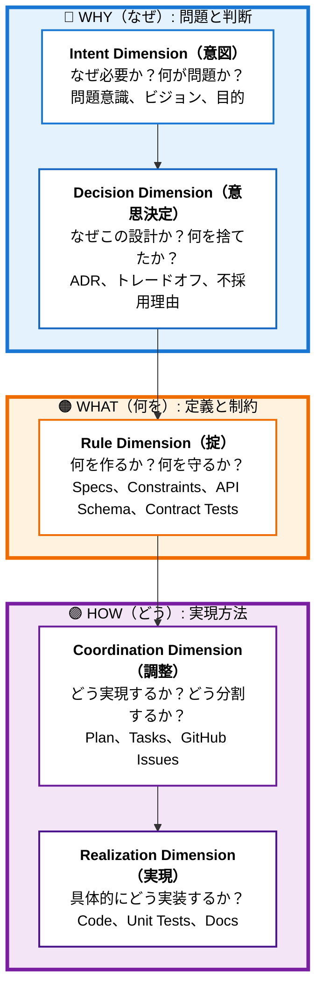
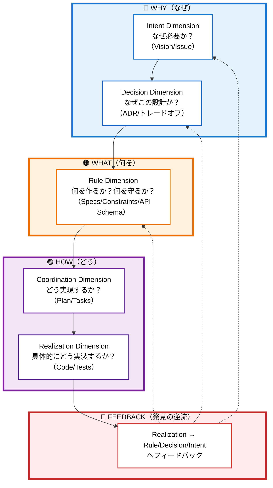
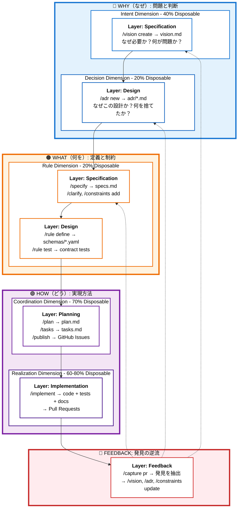

# YokaKit Studio - Context Studio (文脈統合開発環境)

## Vision: AI開発を前提とした文脈統合開発環境

YokaKit Studioは、従来のIDE(統合開発環境)を超えた**Context Studio(文脈統合開発環境)**です。
GitHub連携をベースに、開発における「文脈」を統合管理し、人間とAIの協働開発を最適化します。

### 従来のIDEとの違い

| 観点 | 従来のIDE | Context Studio (YokaKit Studio) |
|------|-----------|--------------------------------|
| 焦点 | コード編集・実行 | 文脈の統合・追跡 |
| 主な利用者 | 人間の開発者 | 人間 + AI開発者 |
| 情報源 | ローカルファイル | GitHub (Issues/PRs/Discussions) + ローカル |
| ワークフロー | エディタ中心 | 文脈中心 (Context-First) |
| トレーサビリティ | コミット履歴のみ | Issue→Spec→Design→Code→Test の完全追跡 |

## Core Concepts

### 1. Context Framework: 主軸 + 明文化の工程 + 評価基準

**「Permanentは存在しない。すべては代替可能性で評価する」**

Context Studioは、開発における文脈を**思考の流れ（主軸）**と**明文化の工程**と**評価基準**で整理します：

#### 主軸: Context Dimension（文脈次元）- Why → What → How の思考の流れ

開発における普遍的な思考の流れを5つのDimensionで表現：



**Forward Flow**: Intent → Decision → Rule → Coordination → Realization（抽象→具体）

#### 明文化の工程: Context Layer（文脈層）- 各Dimensionを文書化する場所

各Dimensionの文脈を明文化・具体化する5つの工程：

| Layer | 役割 | 明文化するDimension |
|-------|------|-------------------|
| **Specification** | 仕様化：何を作るか・なぜ必要か | Intent, Rule |
| **Design** | 設計判断：なぜこの設計か | Decision, Rule |
| **Planning** | 計画：どう実現するか | Coordination |
| **Implementation** | 実装：具体的に作る | Realization |
| **Feedback** | 発見の反映：すべてのDimensionへ逆流 | すべて |

#### 評価基準: 代替可能性（Disposability）- AI再生成の難易度

**各Dimensionが持つ代替可能性**：

各Dimensionの文脈は、抽象度に応じて異なる代替可能性を持ちます。この指標は以下の判断に使用されます：
- **AI再生成の難易度**: どこまでAIが推測・復元できるか
- **Feedback時の影響範囲**: 実装中の発見があったとき、どのDimensionまで遡って見直すか
- **変更のコスト**: 修正・更新にどれだけのリスクとコストがかかるか

```mermaid
%%{init: {'theme':'base', 'themeVariables': { 'fontSize':'14px'}}}%%
flowchart TB
    subgraph Durable["🟩 低代替可能性 (Durable) - AI再生成困難・保存すべき文脈"]
        direction TB
        Decision["<b>Decision Dimension - 20%</b><br/>🧠 ADR（設計判断／トレードオフ）<br/>→ Feedback時に慎重な見直しが必要"]
        Rule["<b>Rule Dimension - 20%</b><br/>📜 Specs、⚖️ Constraints、🧪 Contract Tests<br/>→ 保存すべき文脈"]
    end

    subgraph Medium["⬜ 中代替可能性 - AI部分再生成可能"]
        direction TB
        Intent["<b>Intent Dimension - 40%</b><br/>🧭 Vision（ビジョン／問題意識）<br/>→ Feedback時に影響範囲を確認"]
    end

    subgraph Disposable["🟥 高代替可能性 (Disposable) - AI再生成可能"]
        direction TB
        Coordination["<b>Coordination Dimension - 70%</b><br/>📐 Plan、Tasks<br/>→ AIほぼ再生成可能・修正コスト低"]
        Realization["<b>Realization Dimension - 80%</b><br/>💻 Code、🧪 Unit Tests、📓 Docs<br/>→ AI完全再生成可能・いつでも作り直せる"]
    end

    style Durable fill:#e8f5e9,stroke:#2e7d32,stroke-width:4px,color:#000
    style Medium fill:#fff8e1,stroke:#f57f17,stroke-width:4px,color:#000
    style Disposable fill:#ffebee,stroke:#c62828,stroke-width:4px,color:#000
    style Decision fill:#fff,stroke:#2e7d32,stroke-width:2px,color:#000
    style Rule fill:#fff,stroke:#2e7d32,stroke-width:2px,color:#000
    style Intent fill:#fff,stroke:#f57f17,stroke-width:2px,color:#000
    style Coordination fill:#fff,stroke:#c62828,stroke-width:2px,color:#000
    style Realization fill:#fff,stroke:#b71c1c,stroke-width:2px,color:#000
```



**重要な洞察**:
- **AIのリバースは「今ある形」の復元のみ**
- **意図・トレードオフ・不採用理由・守るべき制約はコードから出てこない**
- **だから残すべき「設計」は図面ではなく、ADR＋制約＋ドメイン不変条件＋API/スキーマ/コントラクトテスト**
- **低代替可能性（20-40%）の文脈は、次のモデル／エージェント世代への置換コストを最小化する**

### 2. Dimension-First Development (文脈次元ファースト開発)

すべての開発活動は**Dimensionの流れ（Why → What → How）**に沿って進みます：



この流れに沿って、各Dimensionを**Layer（明文化の工程）**で文書化していきます。

### 3. GitHub-Centric Integration
GitHubを中心ハブとして、すべての文脈を統合:
- **Issue** → Context (問題・要求)
- **Discussion** → Context (設計議論・ADR)
- **Pull Request** → Context (実装・レビュー・フィードバック)
- **Actions** → Context (CI/CD・品質メトリクス)

### 4. AI-Native Workflow
AI開発者(Claude/Copilot/etc.)との協働を前提:
- AI が理解しやすい文脈の構造化（Durable層の明確化）
- AI が実行可能なタスクの明確化（tasks.md → GitHub Issue）
- AI の意思決定プロセスの可視化（ADR/Constraints記録）

## Architecture

### Dimension × Layer Matrix（完全なワークフロー）

Context Studioでは、**Dimension（思考の流れ）** を **Layer（明文化の工程）** で文書化します。

#### 各Dimensionの明文化場所と成果物

| Dimension | 明文化されるLayer | 成果物 | Disposability |
|-----------|------------------|--------|---------------|
| **Intent** | Specification | vision.md | 40% |
| **Decision** | Design | adr/*.md | 20% |
| **Rule** | Specification<br>Design | specs.md, constraints.md<br>schemas/*.yaml, contract tests | 20% |
| **Coordination** | Planning<br>Implementation | plan.md, tasks.md<br>GitHub Issues | 70% |
| **Realization** | Implementation | code, unit tests, docs | 60-80% |
| **Feedback** | Feedback（横断） | すべてのDimensionへ逆流<br>- Realization → Rule<br>- Realization → Decision<br>- Realization → Intent | - |

**重要な関係性**:
- **Rule Dimension**は、Specification（specs.md）とDesign（schemas/*.yaml）の両方で明文化される
- **Coordination Dimension**は、Planning（tasks.md）とImplementation（GitHub Issues）で扱われる
- **Feedback**は、実装の発見を抽象度の高いDimensionへ逆流させる

#### 完全なワークフロー: Dimensionの流れ（Why → What → How → Feedback）



**重要な原則**:
- **Forward Flow**: Intent → Decision → Rule → Coordination → Realization（抽象→具体）
- **Feedback Flow**: Realization → Rule/Decision/Intent（具体→抽象へ発見を反映）
- **代替可能性**: WHY/WHAT（20-40%）は低代替可能性（保存すべき文脈）。HOW（60-80%）は高代替可能性（再生成可能）

## Current State (現在の実装状況)

### ✅ 実装済み（Rule & Coordination Dimension の一部）
- **Constitution**: `/constitution` - プロジェクト原則管理
- **Rule Dimension**: `/specify`, `/clarify` - 仕様定義・曖昧性解消
- **Coordination Dimension**: `/plan`, `/tasks` - 実装戦略・タスク分解
- **Analysis**: `/analyze` - 整合性分析
- **Implementation**: `/implement` - 実装実行（Realization Dimensionへの橋渡し）

### 🚧 Intent & Decision Dimension（優先度:高）
- `/vision create/update` - Intent Dimension: ビジョン管理 (40% Disposable)
- `/adr new/list/update` - Decision Dimension: ADR管理 (20% Disposable)

### 🚧 Rule Dimension の拡充（優先度:高）
- `/constraints add/verify` - 制約・不変条件管理（掟） (20% Disposable)
- `/rule define/test` - APIスキーマ定義・テスト（掟） (20% Disposable)

### 🚧 Coordination Dimension: GitHub連携（優先度:高）
- `/publish tasks-to-github` - tasks.md → GitHub Issues化（自動ラベル付与）
- `/sync github-to-tasks` - GitHub状態 → tasks.md同期
- `/implement` のGitHub連携強化（Issue更新・PR作成）

### 🚧 Feedback Flow（優先度:中）
- `/capture issue` - GitHub Issue → 文脈抽出
- `/capture pr` - Pull Request → 上流Dimensionへフィードバック
- `/analyze debt` - 技術的負債分析 → Rule/Decision Dimensionへの反映
- Context Navigation UI（Dimension間のトレーサビリティ）

## Project Structure

Context Studioでは、**Context Layer × Context Dimension** に基づいてディレクトリを構造化します：

```
YokaKit_Studio/
├── .claude/                  # Claude Code configuration
│   ├── settings.local.json
│   └── commands/             # Custom slash commands
│       ├── [Intent Dimension]
│       │   └── vision.md         # 🚧 Vision management
│       ├── [Decision Dimension]
│       │   └── adr.md            # 🚧 ADR management
│       ├── [Rule Dimension]
│       │   ├── specify.md        # ✅ Specification creation
│       │   ├── clarify.md        # ✅ Ambiguity resolution
│       │   ├── constraints.md    # 🚧 Constraints management
│       │   └── rule.md           # 🚧 Rule (schema) definition/test
│       ├── [Coordination Dimension]
│       │   ├── plan.md           # ✅ Implementation planning
│       │   ├── tasks.md          # ✅ Task list generation
│       │   ├── publish.md        # 🚧 Tasks → GitHub Issues
│       │   └── sync.md           # 🚧 GitHub ↔ Tasks sync
│       ├── [Realization Dimension]
│       │   ├── implement.md      # ✅ Task execution
│       │   └── generate.md       # 🚧 AI code generation
│       ├── [Cross-Dimension]
│       │   ├── capture.md        # 🚧 Issue/PR → Context
│       │   └── analyze.md        # ✅ Consistency analysis
│       └── constitution.md       # ✅ Project constitution
│
├── .specify/                 # Workflow infrastructure
│   ├── scripts/bash/         # Automation scripts
│   ├── templates/            # Command templates
│   └── memory/
│       └── constitution.md   # Project principles
│
├── contexts/                 # 🚧 Context storage (Context Layer: Specification/Design)
│   └── [###-feature-name]/
│       ├── intent/           # Intent Dimension (40%)
│       │   └── vision.md     # Why this feature
│       ├── decision/         # Decision Dimension (20%)
│       │   └── adr/          # Architecture decisions
│       │       ├── 001-*.md
│       │       └── 002-*.md
│       └── rule/             # Rule Dimension (20%)
│           ├── specs.md      # What to build
│           ├── constraints.md # Invariants and rules (掟)
│           └── schemas/      # API schemas & contract tests
│
├── coordination/             # 🚧 Coordination Dimension (Context Layer: Planning) (70%)
│   └── [###-feature-name]/
│       ├── plan.md           # Implementation strategy
│       └── tasks.md          # Task breakdown (→ GitHub Issues)
│
├── .serena/                  # Serena MCP configuration
├── .mcp.json                 # MCP servers configuration
└── yokakit/                  # Git submodule - Laravel application
```

## Getting Started

### Prerequisites
- Claude Code CLI
- Git
- (Optional) Docker for YokaKit development

### Quick Start
1. Clone this repository
2. Initialize submodule: `git submodule update --init --recursive`
3. Start with Context Studio workflow:
   - `/constitution` - Define project principles
   - `/specify <feature description>` - Create feature specification
   - Follow the workflow prompts

## Command Reference

コマンドは**Context Dimension（文脈次元）**ごとに整理されています。

### 【Intent Dimension】意図次元 (40% Disposable)

Context Layer: Specification

```bash
# Vision Management (🚧 未実装)
/vision create <feature-name>    # ビジョン文書作成
/vision update <feature-name>    # ビジョン更新
/vision link <issue-url>         # GitHub Issueとリンク
```

### 【Decision Dimension】意思決定次元 (20% Disposable)

Context Layer: Design

```bash
# ADR Management (🚧 未実装)
/adr new <decision-title>        # 新しいADR作成
/adr list [feature-name]         # ADR一覧表示
/adr update <adr-number>         # ADR更新
/adr supersede <old> <new>       # ADRの更新・廃止
```

### 【Rule Dimension】掟次元 (20% Disposable)

Context Layer: Specification & Design

```bash
# Specification (✅ 実装済み)
/specify <description>           # 仕様定義
/clarify                         # 曖昧性解消

# Constraints Management (🚧 未実装)
/constraints add <feature-name>  # 制約・不変条件追加（掟）
/constraints verify <feature>    # 掟違反チェック

# Rule (Schema) Management (🚧 未実装)
/rule define <api-name>          # APIスキーマ定義（掟）
/rule test <api-name>            # コントラクトテスト実行
```

### 【Coordination Dimension】調整次元 (70% Disposable)

Context Layer: Planning

```bash
# Planning (✅ 実装済み)
/plan                            # 実装戦略策定
/tasks                           # タスク分解

# GitHub Integration (🚧 未実装)
/publish tasks-to-github         # tasks.md → GitHub Issues化
/sync github-to-tasks            # GitHub状態同期

# Analysis (✅ 実装済み)
/analyze                         # 整合性分析
```

### 【Realization Dimension】実現次元 (60-80% Disposable)

Context Layer: Implementation

```bash
# Execution (✅ 実装済み / 🚧 GitHub連携強化予定)
/implement <task-id>             # タスク実行
/implement <issue-url>           # 🚧 Issue URLから実行

# Generation (🚧 未実装)
/generate code <from-spec>       # コード生成
/generate tests <from-contract>  # テスト生成
```

### 【Cross-Dimension】横断的コマンド

Context Layer: Feedback

```bash
# Context Capture (🚧 未実装)
/capture issue <issue-number>    # Issue → 文脈抽出
/capture pr <pr-number>          # PR → 上流Dimensionフィードバック
/analyze debt                    # 技術的負債分析

# Foundation (✅ 実装済み)
/constitution                    # プロジェクト憲章管理
```

---

## Workflow Examples

### Example 1: 新機能開発（Context Layer × Context Dimension 完全フロー）

```bash
# === Layer 1: Specification - Intent Dimension (40%) ===
$ /vision create "multi-account-switching"
→ contexts/001-multi-account/intent/vision.md

# === Layer 2: Design - Decision Dimension (20%) ===
$ /adr new "認証状態の管理方法"
→ contexts/001-multi-account/decision/adr/001-auth-state.md

# === Layer 1: Specification - Rule Dimension (20%) ===
$ /specify "ユーザーが複数アカウントを切り替えられる機能"
→ contexts/001-multi-account/rule/specs.md
$ /clarify
$ /constraints add "account-switching"
→ contexts/001-multi-account/rule/constraints.md

# === Layer 2: Design - Rule Dimension (20%) ===
$ /rule define "account-api"
→ contexts/001-multi-account/rule/schemas/account-api.yaml

# === Layer 3: Planning - Coordination Dimension (70%) ===
$ /plan
→ coordination/001-multi-account/plan.md
$ /tasks
→ coordination/001-multi-account/tasks.md
$ /publish tasks-to-github
→ GitHub Issues #101〜#120 作成（dimension::coordination ラベル付与）

# === Layer 4: Implementation - Realization Dimension (60-80%) ===
$ /implement #101
→ コード生成 (80%) → PR #201作成

# === Layer 5: Feedback（Realization → Decision Dimension） ===
$ /capture pr #201
→ "トークン更新戦略" の判断が必要と判明
→ Decision Dimensionへフィードバック: /adr new "トークン更新戦略"
```

### Example 2: GitHub Issue起点の開発

```bash
# Issue から開始（Layer 5: Feedback → Layer 1: Specification）
$ /capture issue 456
→ vision.md自動生成

# 以降は Example 1 と同じフロー
$ /specify ...
```

### Example 3: 技術的負債への対応

```bash
# 負債分析（Cross-Dimension）
$ /analyze debt
→ 技術的負債検出

# Decision & Rule Dimensionへのフィードバック
$ /adr new "負債解消のリファクタリング方針"
$ /constraints verify <affected-features>

# 通常のフロー継続
$ /tasks
$ /publish tasks-to-github
$ /implement ...
```

---

## GitHub Label Strategy

Context Studioでは、GitHubラベルを**多次元的**に活用して文脈を管理します。
**Context Layer × Context Dimension**の2軸と**Disposability（代替可能性）**の評価基準に基づいて、ラベルを設計します。

### Label Categories（7つのカテゴリ）

#### 1. Context Dimension（文脈次元）- 最重要軸

文脈を捉える観点を示す：

| ラベル | 代替可能性 | 意味 | 対応する文書 |
|--------|-----------|------|--------------|
| `dimension::intent` | 40% | なぜ必要か（Why） | vision.md |
| `dimension::decision` | 20% | なぜこの設計か（トレードオフ） | adr/*.md |
| `dimension::rule` | 20% | 何を作るか（仕様・制約・掟） | specs.md, constraints.md, schemas/*.yaml |
| `dimension::coordination` | 70% | どう実現するか（計画・分解） | plan.md, tasks.md |
| `dimension::realization` | 80% | 具体的な実装 | code, tests |

**使い分け:**
- 問題意識・ビジョン議論 → `dimension::intent`
- 設計判断・トレードオフ記録 → `dimension::decision`
- 仕様・制約・掟（API定義） → `dimension::rule`
- 計画・タスク分解 → `dimension::coordination`
- 実装・コード → `dimension::realization`

#### 2. Context Type（具体的な文脈の種類）

各Context Dimension内での具体的な種類：

| ラベル | Context Dimension | 意味 |
|--------|-------------------|------|
| `context::vision` | Intent | ビジョン文書 |
| `context::adr` | Decision | ADR（Architecture Decision Records） |
| `context::spec` | Rule | 仕様定義 |
| `context::constraint` | Rule | 制約・不変条件（掟） |
| `context::schema` | Rule | APIスキーマ・コントラクト（掟） |
| `context::plan` | Coordination | 実装戦略 |
| `context::task` | Coordination | タスク分解 |

#### 3. Context Layer（文脈層）

文脈が生成・変換される5つの層を示す：

| ラベル | 説明 |
|--------|------|
| `context-layer::specification` | 仕様化層（vision, specs, constraints作成） |
| `context-layer::design` | 設計判断層（ADR, schemas, contract tests作成） |
| `context-layer::planning` | 計画層（plan, tasks作成、GitHub Issues公開） |
| `context-layer::implementation` | 実装層（code, tests作成、PR作成） |
| `context-layer::feedback` | フィードバック層（実装の発見を上流へ反映） |

#### 4. Work Type（作業の種類）- spec駆動開発から継承

| ラベル | 説明 |
|--------|------|
| `work::epic` | 大きな機能群（複数のstoryを含む） |
| `work::story` | ユーザーストーリー（実装可能な単位） |
| `work::task` | 具体的な実装タスク |
| `work::debt` | 技術的負債 |
| `work::spike` | 調査・検証タスク |

#### 5. Context State（文脈の状態）

| ラベル | 説明 |
|--------|------|
| `state::needs-clarification` | `/clarify` が必要 |
| `state::needs-adr` | 設計判断が必要 |
| `state::needs-constraint` | 制約定義が必要 |
| `state::has-ambiguity` | 曖昧性あり |
| `state::ready-for-plan` | `/plan` 実行可能 |
| `state::ready-for-implementation` | 実装準備完了 |

#### 6. Feedback Source（フィードバック元）

| ラベル | 説明 |
|--------|------|
| `feedback::from-pr` | PR実装から得られた知見 |
| `feedback::from-review` | レビューから得られた知見 |
| `feedback::constraint-violation` | 制約違反の発見 |
| `feedback::adr-update-needed` | ADR更新が必要 |

#### 7. Disposability（代替可能性）

| ラベル | 説明 |
|--------|------|
| `disposable::20%` | 低代替可能性（AI再生成困難・保存すべき文脈） |
| `disposable::40%` | 中低代替可能性（ビジョン・部分的に再生成可能） |
| `disposable::70%` | 高代替可能性（調整層・ほぼ再生成可能） |
| `disposable::80%` | 最高代替可能性（実装・完全再生成可能） |

---

### Label Combination Patterns（組み合わせパターン）

#### Pattern 1: Vision議論のIssue（Intent Dimension, Specification Layer）

```
dimension::intent + context::vision + work::epic + context-layer::specification + disposable::40%
```

**例:** Issue #1 "マルチアカウント切り替え機能のビジョン"

#### Pattern 2: ADR作成のIssue（Decision Dimension, Design Layer）

```
dimension::decision + context::adr + work::story + context-layer::design + disposable::20%
```

**例:** Issue #10 "認証状態の管理方法（ADR-001）"

#### Pattern 3: 仕様定義のIssue（Rule Dimension, Specification Layer）

```
dimension::rule + context::spec + work::story + context-layer::specification + disposable::20%
```

**例:** Issue #5 "アカウント切り替えAPIの仕様定義"

#### Pattern 4: `/publish tasks-to-github` で生成されたタスク（Coordination Dimension, Planning Layer）

```
dimension::coordination + context::task + work::task + context-layer::planning + disposable::70%
```

**例:** Issue #101 "アカウント切り替えAPIの実装計画（T001）"

#### Pattern 5: 実装Issue（Realization Dimension, Implementation Layer）

```
dimension::realization + work::task + context-layer::implementation + disposable::80%
```

**例:** Issue #102 "アカウントモデルの実装"

#### Pattern 6: PR実装からのフィードバック（Decision Dimensionへ）

```
dimension::decision + context::adr + feedback::from-pr + context-layer::feedback + disposable::20%
```

**例:** Issue #150 "トークン更新戦略のADR追加（PR #201からの発見）"

#### Pattern 7: 技術的負債の発見（Rule Dimensionへ）

```
dimension::rule + context::constraint + work::debt + feedback::constraint-violation + state::needs-adr
```

**例:** Issue #200 "認証トークンの有効期限管理の掟違反"

---

### Auto-Labeling Rules（`/publish tasks-to-github` での自動ラベル付与）

```yaml
# tasks.md から GitHub Issue 作成時の自動ラベル付与ルール

# タスクの種類による判定
setup_task:
  labels: [dimension::coordination, work::task, context-layer::implementation]

test_task:
  labels: [dimension::realization, work::task, context-layer::implementation]

implement_task:
  labels: [dimension::realization, work::task, context-layer::implementation]

# tasks.md のメタデータから判定
metadata:
  "related-to: vision": [dimension::intent, context::vision, disposable::40%]
  "related-to: adr": [dimension::decision, context::adr, disposable::20%]
  "related-to: spec": [dimension::rule, context::spec, disposable::20%]
  "related-to: constraint": [dimension::rule, context::constraint, disposable::20%]
  "related-to: schema": [dimension::rule, context::schema, disposable::20%]

# タスクの依存関係から
dependency:
  "blocks: T001": [work::epic]
  "[P]": [work::task]  # 並列実行可能マーカー

# Feedback元の判定
feedback:
  "from: PR": [feedback::from-pr, context-layer::feedback]
  "from: review": [feedback::from-review, context-layer::feedback]
  "rule-violation": [feedback::constraint-violation, dimension::rule]
```

---

### Label-Based Queries（ラベルを活用した検索例）

```bash
# Intent Dimension（意図次元）の文脈のみ表示
is:issue label:dimension::intent

# Decision Dimension（意思決定次元）の文脈のみ表示
is:issue label:dimension::decision

# Rule Dimension（掟次元）の文脈のみ表示
is:issue label:dimension::rule

# 低代替可能性（20-40%）のすべての文脈
is:issue label:disposable::20%,disposable::40%

# ADRに関するすべてのIssue
is:issue label:context::adr

# PRレビューから生まれたフィードバック
is:issue label:feedback::from-pr

# 曖昧性があり /clarify が必要なIssue
is:issue label:state::needs-clarification is:open

# 実装準備完了で待機中のIssue
is:issue label:state::ready-for-implementation is:open

# 技術的負債
is:issue label:work::debt is:open

# Coordination & Realization Dimension（高代替可能性）の実装タスク
is:issue label:dimension::coordination,dimension::realization

# Specification Layer（低代替可能性文脈の構築中）のすべてのIssue
is:issue label:context-layer::specification

# Implementation Layer（実装中）のすべてのIssue
is:issue label:context-layer::implementation
```

---

### Workflow Example with Labels（ラベルを使った完全フロー）

```bash
# === Layer 1 & 2: Specification & Design（低代替可能性文脈の構築） ===

Issue #1: "マルチアカウント切り替え機能のビジョン"
  Labels: dimension::intent, context::vision, work::epic, context-layer::specification, disposable::40%
  Dimension: Intent - Disposable 40%

Issue #2: "認証状態の管理方法（ADR-001）"
  Labels: dimension::decision, context::adr, work::story, context-layer::design, disposable::20%
  Dimension: Decision - Disposable 20%

Issue #3: "アカウント切り替え機能の仕様"
  Labels: dimension::rule, context::spec, work::story, context-layer::specification, disposable::20%
  Dimension: Rule - Disposable 20%

Issue #4: "アカウント切り替えの掟（制約）定義"
  Labels: dimension::rule, context::constraint, work::story, context-layer::specification, disposable::20%
  Dimension: Rule - Disposable 20%

Issue #5: "アカウント切り替えAPIスキーマ定義"
  Labels: dimension::rule, context::schema, work::story, context-layer::design, disposable::20%
  Dimension: Rule - Disposable 20%

# === Layer 3: Planning（調整層） ===
$ /plan
$ /tasks
$ /publish tasks-to-github

Issue #101: "アカウントモデルの実装（T001）"
  Labels: dimension::coordination, context::task, work::task, context-layer::planning, disposable::70%
  Dimension: Coordination - Disposable 70%
  Related: #3, #4

Issue #102: "認証トークン管理サービスの実装（T002）"
  Labels: dimension::coordination, context::task, work::task, context-layer::planning, disposable::70%
  Dimension: Coordination - Disposable 70%
  Related: #2, #4

# === Layer 4: Implementation（実装層） ===
$ /implement #101
→ code (80%), unit tests (70%), docs (60%)
→ PR #201 作成（Realization Dimension）

# === Layer 5: Feedback（実装 → 上流Dimension） ===
$ /capture pr #201
→ 実装中に「トークン更新戦略」の判断が必要と判明

Issue #150: "トークン更新戦略のADR追加（PR #201からの発見）"
  Labels: dimension::decision, context::adr, feedback::from-pr, context-layer::feedback, disposable::20%
  Dimension: Decision - Disposable 20%
  Related: #2, PR #201

→ Realization Dimension → Decision Dimension へのフィードバック
```

---

## Contributing

Context Studioのビジョン実現に向けて、継続的な改善を行っています。

## License

(To be determined)

## Related Projects

- **YokaKit**: Laravel-based web application (submodule at `./yokakit/`)
