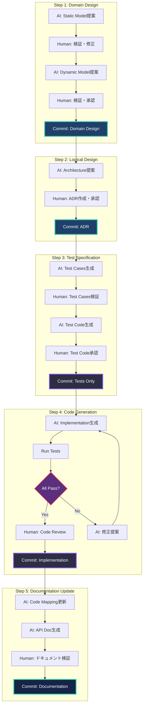

# AI-DLC Development Process: TDD & Documentation-Driven

**AI主導コード生成 × TDD × ドキュメント駆動の開発プロセス最適化**

AIがほぼすべてのコードを書く前提において、品質を担保するための徹底したプロセス定義。

---

## Core Principles

### 1. Documentation-First（ドキュメント先行）

```
Domain Design → ADR → Tests Specification → Code
```

**理由**: 
- AIはドキュメント（文脈）からコードを生成
- ドキュメントが不完全 → コードも不完全
- **ドキュメント = 人間の意図の明示化**

### 2. Test-Driven Development（テスト駆動開発）

```
Test Cases (Human Verified) → AI Generates Code → Tests Pass
```

**理由**:
- AIが書くコードは予測不可能
- テストが仕様の明確化
- **テスト = AIへの制約条件**

### 3. Continuous Verification（継続的検証）

```
各ステップで人間が検証 → 下流の無駄削減（Loss Function）
```

**理由**:
- 早期発見・早期修正
- AIの誤りを早い段階で補正
- **検証 = 品質の担保**

---

## Construction Phase: Detailed Workflow

### Phase Overview



---
