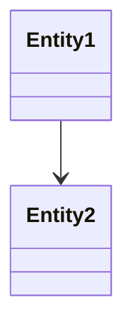
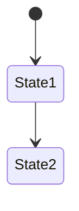

# Step 1: Domain Design（ドメイン設計）

### 1.1 Static Model（静的モデル）

**AI Prompt Template**:
```
Context: {Intent, User Stories}

Task: 以下のUser Storiesを実現するDomain Modelを設計してください。

User Stories:
- {story-1}
- {story-2}

Output Format:
# Static Model

## Entities
- Entity名
  - 責任: ...
  - 属性: ...
  - 振る舞い: ...

## Value Objects
- VO名
  - 責任: ...
  - 属性: ...

## Services
- Service名
  - 責任: ...
  - 依存: ...

## Repositories
- Repository名
  - 責任: ...

## Relationships

```

**Human Verification Checklist**:
```markdown
- [ ] すべてのUser Storyがカバーされているか
- [ ] Entity/VOの責任が明確か
- [ ] 依存関係が疎結合か
- [ ] DDDの戦術パターンに従っているか
- [ ] 将来の拡張性が考慮されているか
```

**Output**: `.aidlc/contexts/001-*/construction/domain-design/static-model.md`

---

### 1.2 Dynamic Model（動的モデル）

**AI Prompt Template**:
```
Context: {Static Model}

Task: 主要なUser Storiesの実現フローを動的モデルとして表現してください。

User Story: {story-1}

Output Format:
# Dynamic Model: {story-1}

## Sequence Diagram
```mermaid
sequenceDiagram
  Actor->>Entity: action()
  Entity->>Service: process()
  Service->>Repository: save()
```

## State Diagram (if applicable)


## Flow Description
1. ...
2. ...
```

**Human Verification Checklist**:
```markdown
- [ ] フローが論理的に正しいか
- [ ] エラーハンドリングが考慮されているか
- [ ] トランザクション境界が明確か
- [ ] パフォーマンス上の問題がないか
```

**Output**: `.aidlc/contexts/001-*/construction/domain-design/dynamic-model.md`

---

### 1.3 Commit: Domain Design

```bash
git checkout -b construction/001-multi-account/domain-design
git add .aidlc/contexts/001-*/construction/domain-design/
git commit -m "feat(domain): Add Domain Design for Account Entity

Static Model:
- Account Entity
- SwitchAccountService
- AccountRepository

Dynamic Model:
- Account switching flow
- Session management flow

Reviewed-by: @architect"

git push origin construction/001-multi-account/domain-design
```

**GitHub PR**:
- Title: `[Construction] Domain Design: Account Entity`
- Labels: `artifact::domain-design`, `phase::construction`, `context::001`
- Reviewers: Architect（必須）

---
