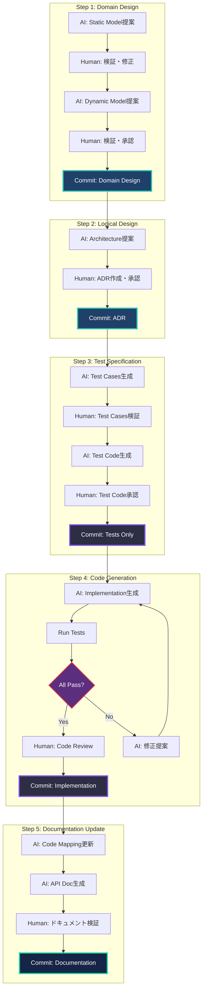
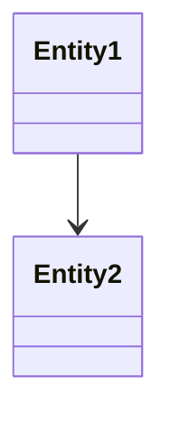
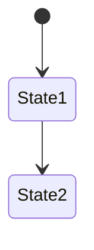

# AI-DLC Development Process: TDD & Documentation-Driven

**AI主導コード生成 × TDD × ドキュメント駆動の開発プロセス最適化**

AIがほぼすべてのコードを書く前提において、品質を担保するための徹底したプロセス定義。

---

## Core Principles

### 1. Documentation-First（ドキュメント先行）

```
Domain Design → ADR → Tests Specification → Code
```

**理由**: 
- AIはドキュメント（文脈）からコードを生成
- ドキュメントが不完全 → コードも不完全
- **ドキュメント = 人間の意図の明示化**

### 2. Test-Driven Development（テスト駆動開発）

```
Test Cases (Human Verified) → AI Generates Code → Tests Pass
```

**理由**:
- AIが書くコードは予測不可能
- テストが仕様の明確化
- **テスト = AIへの制約条件**

### 3. Continuous Verification（継続的検証）

```
各ステップで人間が検証 → 下流の無駄削減（Loss Function）
```

**理由**:
- 早期発見・早期修正
- AIの誤りを早い段階で補正
- **検証 = 品質の担保**

---

## Construction Phase: Detailed Workflow

### Phase Overview



---

## Step 1: Domain Design（ドメイン設計）

### 1.1 Static Model（静的モデル）

**AI Prompt Template**:
```
Context: {Intent, User Stories}

Task: 以下のUser Storiesを実現するDomain Modelを設計してください。

User Stories:
- {story-1}
- {story-2}

Output Format:
# Static Model

## Entities
- Entity名
  - 責任: ...
  - 属性: ...
  - 振る舞い: ...

## Value Objects
- VO名
  - 責任: ...
  - 属性: ...

## Services
- Service名
  - 責任: ...
  - 依存: ...

## Repositories
- Repository名
  - 責任: ...

## Relationships

```

**Human Verification Checklist**:
```markdown
- [ ] すべてのUser Storyがカバーされているか
- [ ] Entity/VOの責任が明確か
- [ ] 依存関係が疎結合か
- [ ] DDDの戦術パターンに従っているか
- [ ] 将来の拡張性が考慮されているか
```

**Output**: `.aidlc/contexts/001-*/construction/domain-design/static-model.md`

---

### 1.2 Dynamic Model（動的モデル）

**AI Prompt Template**:
```
Context: {Static Model}

Task: 主要なUser Storiesの実現フローを動的モデルとして表現してください。

User Story: {story-1}

Output Format:
# Dynamic Model: {story-1}

## Sequence Diagram
```mermaid
sequenceDiagram
  Actor->>Entity: action()
  Entity->>Service: process()
  Service->>Repository: save()
```

## State Diagram (if applicable)


## Flow Description
1. ...
2. ...
```

**Human Verification Checklist**:
```markdown
- [ ] フローが論理的に正しいか
- [ ] エラーハンドリングが考慮されているか
- [ ] トランザクション境界が明確か
- [ ] パフォーマンス上の問題がないか
```

**Output**: `.aidlc/contexts/001-*/construction/domain-design/dynamic-model.md`

---

### 1.3 Commit: Domain Design

```bash
git checkout -b construction/001-multi-account/domain-design
git add .aidlc/contexts/001-*/construction/domain-design/
git commit -m "feat(domain): Add Domain Design for Account Entity

Static Model:
- Account Entity
- SwitchAccountService
- AccountRepository

Dynamic Model:
- Account switching flow
- Session management flow

Reviewed-by: @architect"

git push origin construction/001-multi-account/domain-design
```

**GitHub PR**:
- Title: `[Construction] Domain Design: Account Entity`
- Labels: `artifact::domain-design`, `phase::construction`, `context::001`
- Reviewers: Architect（必須）

---

## Step 2: Logical Design（論理設計・ADR）

### 2.1 Architecture Decision

**AI Prompt Template**:
```
Context: {Domain Design, NFRs}

Task: 以下のNFRsを満たすアーキテクチャを提案し、ADRを作成してください。

NFRs:
- マルチデバイス対応
- セッション共有
- 99.9% Availability

Domain Components:
- Account Entity
- SwitchAccountService

Output Format (ADR Template):
# ADR-001: {決定事項}

## Status
Proposed / Accepted / Deprecated

## Context
<!-- 背景・課題 -->

## Decision
<!-- 採用する技術・パターン -->

## Consequences
### Pros
- ...

### Cons
- ...

## Alternatives Considered
### Option 1: {不採用案}
- Pros: ...
- Cons: ...
- なぜ不採用: ...

### Option 2: ...

## Implementation Notes
<!-- 実装時の注意点 -->

## Related
- Domain Design: static-model.md
- NFRs: ../../../inception/nfrs.md
```

**Human Verification Checklist**:
```markdown
- [ ] 決定事項が明確か
- [ ] トレードオフが網羅されているか
- [ ] 不採用理由が説得力があるか
- [ ] 実装可能性が考慮されているか
- [ ] NFRsを満たしているか
- [ ] コスト・運用負荷が妥当か
```

**Output**: `.aidlc/contexts/001-*/construction/logical-design/adr/001-*.md`

---

### 2.2 Commit: ADR

```bash
git checkout -b construction/001-multi-account/logical-design
git add .aidlc/contexts/001-*/construction/logical-design/adr/001-*.md
git commit -m "feat(adr): ADR-001 Redis-based session management

Decision: Redis Cluster for session storage
Alternatives: JWT (rejected), Database session (rejected)

Pros:
- Multi-device support
- Fast read/write
- Horizontal scalability

Cons:
- Additional infrastructure
- Network latency

Reviewed-by: @architect @tech-lead"

git push origin construction/001-multi-account/logical-design
```

**GitHub PR**:
- Title: `[ADR-001] Redis-based session management`
- Labels: `artifact::logical-design`, `phase::construction`, `context::001`
- Reviewers: Architect + Tech Lead（必須）

---

## Step 3: Test Specification（テスト仕様）

### 3.1 Test Cases Generation（AI）

**AI Prompt Template**:
```
Context: {Domain Design, ADR}

Task: 以下のDomain Componentsのテストケースを網羅的に生成してください。

Components:
- Account Entity
- SwitchAccountService

Test Types:
- Unit Tests
- Integration Tests
- Boundary Tests
- Error Cases

Output Format:
# Test Specification: Account Entity

## Unit Tests

### Test Case: UT-001
- Description: アカウント作成が成功する
- Given: 有効なアカウント情報
- When: Account::create()を実行
- Then: Accountインスタンスが生成される
- Assertions:
  - account.id is not null
  - account.name equals input
  - account.createdAt is set

### Test Case: UT-002 (Boundary)
- Description: 名前が空の場合にエラー
- Given: name = ""
- When: Account::create()を実行
- Then: ValidationException がスローされる
- Assertions:
  - exception.message contains "name"

## Integration Tests

### Test Case: IT-001
- Description: アカウント切り替えフロー
- Given: 2つのアカウントが存在
- When: SwitchAccountService::switch(accountId)を実行
- Then: セッションが切り替わる
- Assertions:
  - session.currentAccountId equals accountId
  - Redis contains session data
  - previous account session is preserved

## Coverage Target
- Line Coverage: 100%
- Branch Coverage: 100%
```

**Output**: `.aidlc/contexts/001-*/construction/tests/test-specification.md`

---

### 3.2 Human Verification of Test Cases

**Verification Checklist**:
```markdown
## Test Coverage Verification
- [ ] すべてのUser Storyがカバーされているか
- [ ] 正常系・異常系が網羅されているか
- [ ] Boundary Cases（境界値）がカバーされているか
- [ ] Concurrency（並行処理）が考慮されているか
- [ ] Security（セキュリティ）が考慮されているか

## ADR Compliance
- [ ] ADR-001（Redis）の制約がテストされているか
- [ ] NFRs（性能・可用性）がテストされているか

## Test Quality
- [ ] Given-When-Then形式で明確か
- [ ] Assertionsが具体的か
- [ ] テストが独立しているか（テスト間依存なし）
- [ ] テストデータが明確か
```

**Manual Addition** (if needed):
```markdown
## Additional Test Cases (Human Added)

### Test Case: UT-010 (Security)
- Description: 不正なトークンでアカウント切り替えを試みる
- Given: 無効なセッショントークン
- When: SwitchAccountService::switch(accountId)を実行
- Then: UnauthorizedException がスローされる
```

---

### 3.3 Test Code Generation（AI）

**AI Prompt Template**:
```
Context: {Test Specification, Domain Design, Tech Stack}

Task: 以下のTest SpecificationをPHPUnit形式のテストコードに変換してください。

Test Specification: test-specification.md
Tech Stack: Laravel 10, PHPUnit 10

Output Format (PHPUnit):
```php
<?php

namespace Tests\Unit\Models;

use Tests\TestCase;
use App\Models\Account;
use App\Exceptions\ValidationException;

class AccountTest extends TestCase
{
    /** @test */
    public function it_creates_account_successfully(): void
    {
        // Given: 有効なアカウント情報
        $data = [
            'name' => 'Test User',
            'email' => 'test@example.com',
        ];

        // When: Account::create()を実行
        $account = Account::create($data);

        // Then: Accountインスタンスが生成される
        $this->assertNotNull($account->id);
        $this->assertEquals('Test User', $account->name);
        $this->assertNotNull($account->createdAt);
    }

    /** @test */
    public function it_throws_exception_when_name_is_empty(): void
    {
        // Given: name = ""
        $data = ['name' => '', 'email' => 'test@example.com'];

        // Then: ValidationException がスローされる
        $this->expectException(ValidationException::class);
        $this->expectExceptionMessage('name');

        // When: Account::create()を実行
        Account::create($data);
    }
}
```
```

**Output**: `submodules/code-output/yokakit/tests/Unit/Models/AccountTest.php`

---

### 3.4 Human Review of Test Code

**Review Checklist**:
```markdown
- [ ] Test Specificationと一致しているか
- [ ] Given-When-Then構造が明確か
- [ ] Assertionsが適切か
- [ ] テストデータが適切か
- [ ] セットアップ/ティアダウンが適切か
- [ ] テストが独立しているか
```

---

### 3.5 Commit: Tests Only（実装前）

```bash
cd submodules/code-output/yokakit
git checkout -b feature/001-account-entity-tests

# テストコードのみコミット（実装はまだない）
git add tests/Unit/Models/AccountTest.php
git add tests/Unit/Services/SwitchAccountServiceTest.php
git add tests/Integration/AccountSwitchFlowTest.php

git commit -m "test: Add test suite for Account Entity (TDD)

Test Cases:
- UT-001 ~ UT-010: Account Entity unit tests
- IT-001 ~ IT-005: Account switching integration tests

Based on:
- Context Studio: Domain Design
- Test Specification: .aidlc/contexts/001-*/construction/tests/

Note: Implementation not yet added (TDD approach)
All tests currently FAIL (expected)"

git push origin feature/001-account-entity-tests
```

**GitHub PR**:
- Title: `[TDD] Test Suite: Account Entity`
- Labels: `type::tests`, `context::001`, `status::draft`
- Body:
  ```markdown
  ## Context Studio Reference
  - Domain Design: context-studio#5
  - Test Specification: .aidlc/contexts/001-*/construction/tests/
  
  ## Test Coverage
  - Unit Tests: 10 cases
  - Integration Tests: 5 cases
  - Target Coverage: 100%
  
  ## Status
  - [ ] All tests currently FAIL (expected - no implementation yet)
  - [ ] Ready for implementation phase
  
  ## Next Step
  After this PR merges, AI will generate implementation to make tests pass.
  ```

---

## Step 4: Code Generation（実装生成）

### 4.1 Implementation Code Generation（AI）

**AI Prompt Template**:
```
Context: {Domain Design, ADR, Tests}

Task: 以下のテストがすべてパスする実装を生成してください。

Tests: tests/Unit/Models/AccountTest.php
Domain Design: .aidlc/contexts/001-*/construction/domain-design/
ADR: ADR-001 (Redis-based session)

Constraints:
- すべてのテストをパスすること
- ADR-001の制約を守ること
- Laravel Best Practicesに従うこと
- SOLID原則に従うこと

Output Format (Laravel Model):
```php
<?php

namespace App\Models;

use Illuminate\Database\Eloquent\Model;
use App\Exceptions\ValidationException;

/**
 * Account Entity
 * 
 * Responsibility: ユーザーアカウントの管理
 * 
 * Domain Design: .aidlc/contexts/001-multi-account/construction/domain-design/static-model.md
 * ADR: ADR-001
 */
class Account extends Model
{
    protected $fillable = ['name', 'email'];

    /**
     * アカウント作成
     * 
     * @throws ValidationException
     */
    public static function create(array $data): self
    {
        self::validate($data);
        
        return parent::create($data);
    }

    private static function validate(array $data): void
    {
        if (empty($data['name'])) {
            throw new ValidationException('name is required');
        }
        
        // ... other validations
    }
}
```
```

**Output**: `submodules/code-output/yokakit/app/Models/Account.php`

---

### 4.2 Run Tests（自動）

```bash
cd submodules/code-output/yokakit

# テスト実行
composer test

# 結果例
PHPUnit 10.0.0

...F..                                                              6 / 6 (100%)

Time: 00:00.123, Memory: 20.00 MB

There was 1 failure:

1) Tests\Unit\Models\AccountTest::it_validates_email_format
Failed asserting that exception message contains 'email format'
```

---

### 4.3 AI Fixes（テスト失敗時）

**AI Prompt Template**:
```
Context: {Test Failure Output}

Task: 以下のテスト失敗を修正してください。

Test Failure:
{failure output}

Current Implementation:
{code}

Output: 修正後のコード
```

**Iteration**:
```
Code生成 → Tests実行 → 失敗 → AI修正 → Tests実行 → 成功
```

---

### 4.4 Human Code Review（テスト成功後）

**Review Checklist**:
```markdown
## Functionality
- [ ] すべてのテストがパスしているか
- [ ] テストカバレッジが100%か

## ADR Compliance
- [ ] ADR-001（Redis）の制約を守っているか
- [ ] ADRで決定した技術を正しく使用しているか

## Code Quality
- [ ] SOLID原則に従っているか
- [ ] 命名が明確か（Domain Designと一致）
- [ ] コメントが適切か（最小限）
- [ ] エラーハンドリングが適切か
- [ ] セキュリティ上の問題がないか

## Performance
- [ ] N+1クエリがないか
- [ ] 不要なメモリ確保がないか
- [ ] キャッシュが適切に使われているか

## Maintainability
- [ ] 将来の拡張性が考慮されているか
- [ ] 技術的負債が発生していないか
```

---

### 4.5 Commit: Implementation

```bash
cd submodules/code-output/yokakit
git checkout feature/001-account-entity-tests

# 実装追加
git add app/Models/Account.php
git add app/Services/SwitchAccountService.php
git add app/Repositories/AccountRepository.php

git commit -m "feat: Implement Account Entity

Implementation:
- Account Entity with validation
- SwitchAccountService with Redis session
- AccountRepository interface

Test Results:
- All tests PASS (15/15)
- Coverage: 100%

Based on:
- Domain Design: context-studio#5
- ADR-001: Redis session management
- Test Specification: context-studio#8

Reviewed-by: @developer1 @developer2"

git push origin feature/001-account-entity-tests
```

**GitHub PR Update**:
- Status: `status::draft` → `status::review`
- Body更新:
  ```markdown
  ## Implementation Added
  - ✅ All tests PASS (15/15)
  - ✅ Coverage: 100%
  - ✅ ADR-001 compliant
  
  ## Ready for Review
  - [ ] Code review (2+ developers)
  - [ ] Architect approval (ADR compliance)
  ```

---

## Step 5: Documentation Update

### 5.1 Code Mapping Update（AI）

**AI Prompt Template**:
```
Context: {Domain Design, Implementation}

Task: Domain DesignとCode実装のマッピングを更新してください。

Domain Design: .aidlc/contexts/001-*/construction/domain-design/
Implementation: submodules/code-output/yokakit/app/

Output Format:
# Code Mapping

## Entities
| Domain Entity | Code Path | Status |
|---------------|-----------|--------|
| Account | app/Models/Account.php | ✅ Implemented |
| ... | ... | ... |

## Services
| Domain Service | Code Path | Status |
|----------------|-----------|--------|
| SwitchAccountService | app/Services/SwitchAccountService.php | ✅ Implemented |

## Repositories
| Domain Repository | Code Path | Status |
|-------------------|-----------|--------|
| AccountRepository | app/Repositories/AccountRepository.php | ✅ Implemented |

## Detailed Mapping

### Account Entity
- **Domain**: `.aidlc/contexts/001-*/construction/domain-design/static-model.md#Account`
- **Code**: `submodules/code-output/yokakit/app/Models/Account.php`
- **Tests**: `submodules/code-output/yokakit/tests/Unit/Models/AccountTest.php`
- **ADR**: ADR-001
- **Methods**:
  - `create(array $data)` → Domain: Account生成
  - `validate(array $data)` → Domain: バリデーション
```

**Output**: `.aidlc/contexts/001-*/construction/code-mapping.md`

---

### 5.2 API Documentation Generation（AI）

**AI Prompt Template**:
```
Context: {Implementation}

Task: 以下の実装のAPIドキュメントを生成してください。

Implementation: app/Services/SwitchAccountService.php

Output Format (OpenAPI):
```yaml
openapi: 3.0.0
info:
  title: Account Switching API
  version: 1.0.0

paths:
  /api/accounts/switch:
    post:
      summary: アカウント切り替え
      requestBody:
        content:
          application/json:
            schema:
              type: object
              properties:
                accountId:
                  type: string
                  format: uuid
      responses:
        200:
          description: 成功
        401:
          description: 認証エラー
        404:
          description: アカウントが見つからない
```
```

**Output**: `submodules/code-output/yokakit/docs/api/account-switching.yml`

---

### 5.3 Commit: Documentation

```bash
# Context Studio側
cd /path/to/context-studio
git checkout construction/001-multi-account
git add .aidlc/contexts/001-*/construction/code-mapping.md
git commit -m "docs: Update code mapping for Account Entity

Mapped:
- Account Entity → app/Models/Account.php
- SwitchAccountService → app/Services/SwitchAccountService.php
- AccountRepository → app/Repositories/AccountRepository.php

Implementation: yokakit feature/001-account-entity-tests"
git push

# Code Output側
cd submodules/code-output/yokakit
git checkout feature/001-account-entity-tests
git add docs/api/account-switching.yml
git commit -m "docs: Add API documentation for account switching

OpenAPI spec for Account Switching API

Based on: ADR-001, Domain Design"
git push
```

---

## Verification & Quality Gates

### Gate 1: Domain Design Review

```yaml
Reviewers: Architect
Approval Required: 1
Checks:
  - Markdown lint
  - Mermaid diagram validation
  - Domain terminology consistency
```

### Gate 2: ADR Review

```yaml
Reviewers: Architect + Tech Lead
Approval Required: 2
Checks:
  - ADR format validation
  - Alternatives documented
  - Consequences documented
```

### Gate 3: Test Review

```yaml
Reviewers: Developer (2+)
Approval Required: 2
Checks:
  - Test specification coverage
  - Test code quality
  - Given-When-Then clarity
```

### Gate 4: Implementation Review

```yaml
Reviewers: Developer (2+)
Approval Required: 2
CI/CD Checks:
  - ✅ All tests pass
  - ✅ Coverage >= 100%
  - ✅ Lint pass
  - ✅ Security scan pass
  - ✅ ADR compliance check
  - ✅ Context reference exists
```

---

## CI/CD Pipeline

### Context Studio Pipeline

```yaml
# .github/workflows/context-validation.yml
name: Context Validation

on:
  pull_request:
    paths:
      - '.aidlc/contexts/**'

jobs:
  domain-design-validation:
    runs-on: ubuntu-latest
    steps:
      - uses: actions/checkout@v3
      
      - name: Validate Markdown
        run: markdownlint .aidlc/contexts/
      
      - name: Validate Mermaid Diagrams
        uses: mermaid-js/mermaid-cli@v9
        with:
          files: '.aidlc/contexts/**/domain-design/*.md'
      
      - name: Check Domain Terminology
        run: |
          # User Story用語とDomain Design用語の一貫性チェック
          python scripts/check-domain-terminology.py

  adr-validation:
    runs-on: ubuntu-latest
    steps:
      - uses: actions/checkout@v3
      
      - name: Validate ADR Format
        run: |
          # ADRテンプレート準拠チェック
          python scripts/validate-adr-format.py
      
      - name: Check ADR Completeness
        run: |
          # Alternatives, Consequences存在チェック
          python scripts/check-adr-completeness.py
```

---

### Code Output Pipeline

```yaml
# .github/workflows/ci.yml
name: CI

on:
  pull_request:
    branches: [main]

jobs:
  context-reference-check:
    runs-on: ubuntu-latest
    steps:
      - name: Validate Context Reference
        run: |
          # PR BodyにContext参照があるか
          if ! grep -q "Context Studio Reference" <<< "${{ github.event.pull_request.body }}"; then
            echo "❌ Context Studio Reference required"
            exit 1
          fi

  tests:
    runs-on: ubuntu-latest
    steps:
      - uses: actions/checkout@v3
      
      - name: Setup PHP
        uses: shivammathur/setup-php@v2
        with:
          php-version: 8.2
      
      - name: Install Dependencies
        run: composer install
      
      - name: Run Tests
        run: composer test
      
      - name: Check Coverage
        run: |
          COVERAGE=$(php artisan test --coverage-text | grep "Lines:" | awk '{print $2}' | tr -d '%')
          if [ $COVERAGE -lt 100 ]; then
            echo "❌ Coverage is $COVERAGE% (required: 100%)"
            exit 1
          fi

  lint:
    runs-on: ubuntu-latest
    steps:
      - uses: actions/checkout@v3
      - run: composer install
      - run: ./vendor/bin/phpstan analyse --level=8
      - run: ./vendor/bin/php-cs-fixer fix --dry-run --diff

  security:
    runs-on: ubuntu-latest
    steps:
      - uses: actions/checkout@v3
      - run: composer install
      - run: composer audit
      - uses: aquasecurity/trivy-action@master
        with:
          scan-type: 'fs'
          scan-ref: '.'

  adr-compliance:
    runs-on: ubuntu-latest
    steps:
      - name: Check ADR Compliance
        run: |
          # ADR-001: Redis使用確認
          if grep -q "ADR-001" <<< "${{ github.event.pull_request.body }}"; then
            if ! grep -rq "use Illuminate\\Support\\Facades\\Redis" app/; then
              echo "❌ ADR-001 requires Redis usage"
              exit 1
            fi
          fi
```

---

## Quick Command Reference

### Development Workflow

```bash
# === Step 1: Domain Design ===
git checkout -b construction/001-multi-account/domain-design
# AI: Domain Design生成 → 人間: 検証
git add .aidlc/contexts/001-*/construction/domain-design/
git commit -m "feat(domain): Add Domain Design for Account Entity"
git push && gh pr create

# === Step 2: ADR ===
git checkout -b construction/001-multi-account/logical-design
# AI: ADR生成 → 人間: トレードオフ検証
git add .aidlc/contexts/001-*/construction/logical-design/adr/
git commit -m "feat(adr): ADR-001 Redis session management"
git push && gh pr create

# === Step 3: Tests ===
cd submodules/code-output/yokakit
git checkout -b feature/001-account-entity-tests
# AI: Test Cases生成 → 人間: 検証 → AI: Test Code生成
git add tests/
git commit -m "test: Add test suite for Account Entity (TDD)"
git push && gh pr create --draft

# === Step 4: Implementation ===
# AI: Code生成 → Tests実行 → 失敗 → AI修正 → 成功
composer test  # すべてパスするまで繰り返し
git add app/
git commit -m "feat: Implement Account Entity"
git push
gh pr ready  # draft → ready for review

# === Step 5: Documentation ===
cd /path/to/context-studio
git checkout construction/001-multi-account
# AI: Code Mapping更新
git add .aidlc/contexts/001-*/construction/code-mapping.md
git commit -m "docs: Update code mapping"
git push
```

---

## Best Practices

### ✅ DO

1. **Documentation-First**
   - Domain Design → Tests → Code の順序厳守
   - ADRで技術判断を明記

2. **TDD Strict**
   - テストコードを先にコミット
   - すべてのテストがパスするまで実装をマージしない
   - カバレッジ100%必須

3. **Continuous Verification**
   - 各ステップで人間が検証
   - CI/CDで自動検証
   - 早期発見・早期修正

4. **Traceability**
   - Code MappingでDomain ↔ Code対応を明記
   - PRにContext参照を必ず記載

### ❌ DON'T

1. **Documentation無しでCode生成**
   - Domain DesignなしでAIにコード書かせない
   - ADRなしで技術選定しない

2. **Tests無しでImplementation**
   - テストなしでコードを書かない
   - カバレッジ100%未満でマージしない

3. **人間検証スキップ**
   - AIの出力を盲信しない
   - 各ステップで必ず検証

4. **Traceability欠如**
   - Context参照なしでCode実装しない
   - Code Mapping更新を忘れない

---

## Appendix: Templates

### A1. Test Specification Template

```markdown
# Test Specification: {Component Name}

## Unit Tests

### UT-001: {Test Name}
- **Description**: ...
- **Given**: ...
- **When**: ...
- **Then**: ...
- **Assertions**:
  - ...

### UT-002: {Test Name} (Boundary)
- ...

## Integration Tests

### IT-001: {Test Name}
- **Description**: ...
- **Given**: ...
- **When**: ...
- **Then**: ...
- **Assertions**:
  - ...

## Coverage Target
- Line Coverage: 100%
- Branch Coverage: 100%
- Mutation Score: 80%+
```

### A2. Code Review Checklist

```markdown
# Code Review Checklist

## Functionality
- [ ] すべてのテストがパスしている
- [ ] カバレッジが100%

## ADR Compliance
- [ ] ADR-XXXの制約を守っている
- [ ] ADRで決定した技術を正しく使用している

## Code Quality
- [ ] SOLID原則に従っている
- [ ] 命名が明確（Domain Designと一致）
- [ ] コメントが適切（最小限）
- [ ] エラーハンドリングが適切
- [ ] セキュリティ上の問題がない

## Performance
- [ ] N+1クエリがない
- [ ] 不要なメモリ確保がない
- [ ] キャッシュが適切に使われている

## Maintainability
- [ ] 将来の拡張性が考慮されている
- [ ] 技術的負債が発生していない
```

---

これで**AI主導 × TDD × ドキュメント駆動**の開発プロセス最適化が完了です。
READMEに統合しますか？
