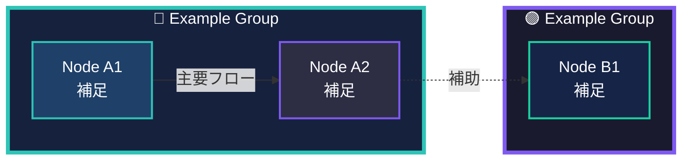

# Style Guide: Mermaid Diagrams

README のアーキテクチャ図やフェーズ図で用いている Mermaid 記法のルールをまとめる。視認性と一貫性を保つため、以下の指針に従うこと。

## デザイン方針
- 情報の流れや責務分担を即座に理解できる構造を優先する。
- 配色・ストローク・フォントカラーは統一したトークンを用い、図表間で雰囲気を揃える。
- テキストは 3 行以内に収め、改行は ` ` を使用して読みやすさを確保する。

## レイアウト選択
- **`graph TB`**: アーキテクチャや階層構造など、上下方向に依存関係がある場合。
- **`flowchart LR`**: プロセスやワークフローを左から右へ示す場合。
- **`flowchart TD`**: フェーズを縦に並べる際（例: Inception → Construction → Operations）。
- `subgraph` を用いて責務領域（Context Studio / Code Output など）を囲み、背景色で差別化する。

## ノード記法
- ノード名には簡潔なキーワードと ` ` を併用した補足を記載する。
- 絵文字（例: 🔵）はフェーズやカテゴリを判別しやすくするために使用し、乱用しない。
- ノード ID は CamelCase など読みやすい形式で定義する（例: `CodeOutput`, `SwitchAccount`）。

## 色とスタイル
| 用途 | fill | stroke | stroke-width | text |
|------|------|--------|--------------|------|
| Context Studio / Inception | `#16213e` | `#2ec4b6` | `4px` (主要グループ) / `2px` (ノード) | `#ffffff` |
| Code Output / Construction | `#1a1a2e` | `#7f5af0` | 同上 | `#ffffff` |
| References / Operations | `#0f3460` or `#162447` | `#feca57` or `#1dd1a1` | 同上 | `#ffffff` |
| ハイライトノード | `#2d2d44`, `#533483`, `#724e91`, `#5c2e7e` | `#7f5af0`, `#9d4edd`, `#c77dff` | `2px` | `#ffffff` |
| 注意・判定ノード | `#5c2e7e` | `#e63946` | `2px` | `#ffffff` |

> 既存色に合わせることで README 内の図とトーンを揃える。追加色が必要な場合は Issue を通じて合意を取る。

## エッジ表現
- 基本は矢印（`-->`）を使用し、流れを一方向に保つ。
- 情報の説明やトレーサビリティは `--> |Label|` で明示する。
- 補助的な関係やフィードバックループは破線（`-.->`）で表現する。
- 双方向のやり取りを示す際は別ノードで循環を描くか、矢印を2本に分けて冗長さを避ける。

## テンプレート

## 運用チェックリスト
- [ ] 図の向きとレイアウトが説明したい内容に合っている。
- [ ] ノードのテキストが 3 行以内に収まり、重複表現がない。
- [ ] スタイルが上記パレットに準拠している。
- [ ] エッジに必要なラベル・補助線の説明が記載されている。
- [ ] README / AGENTS / INDEX の該当項目に新しい図を追記したか確認した。
